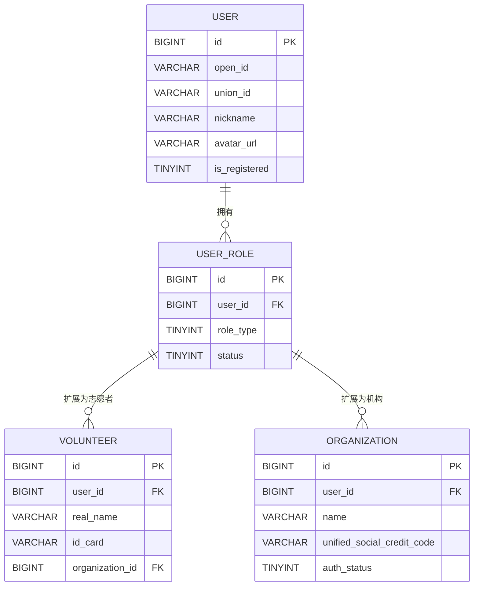
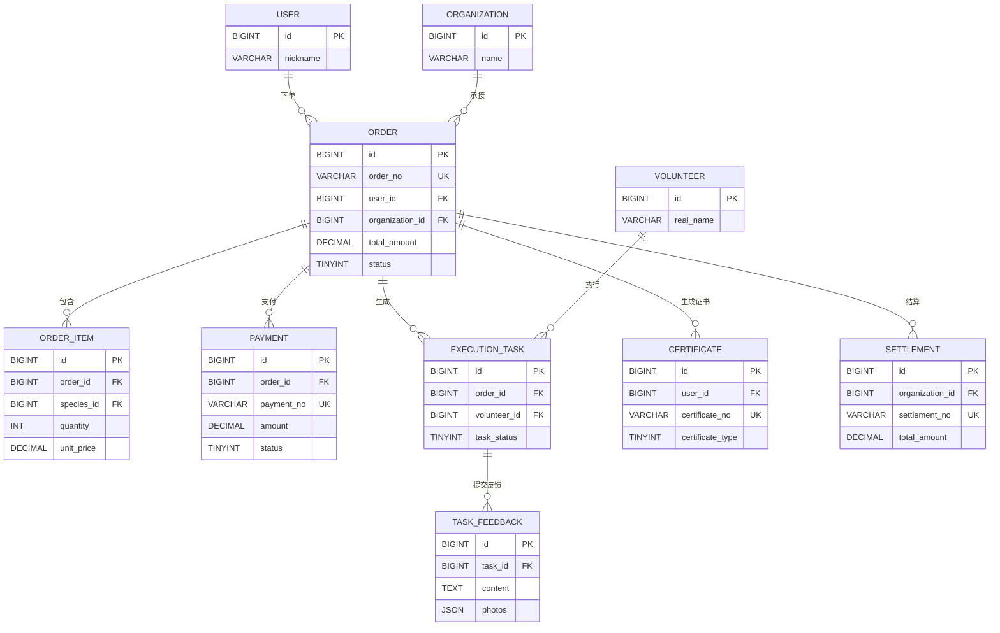
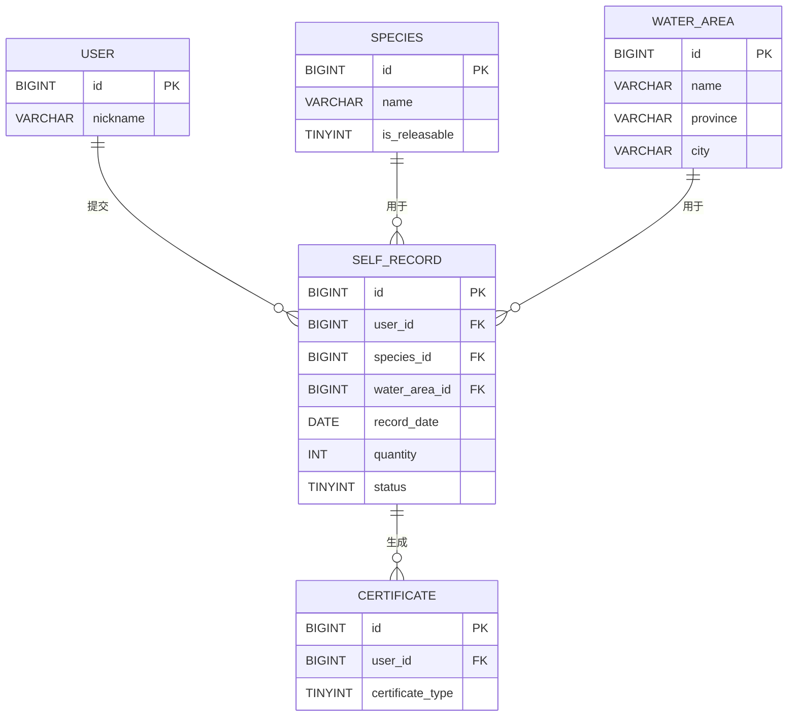
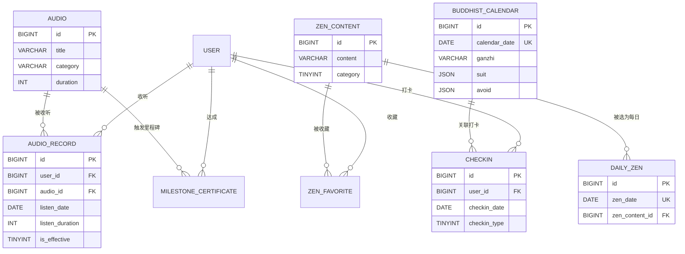
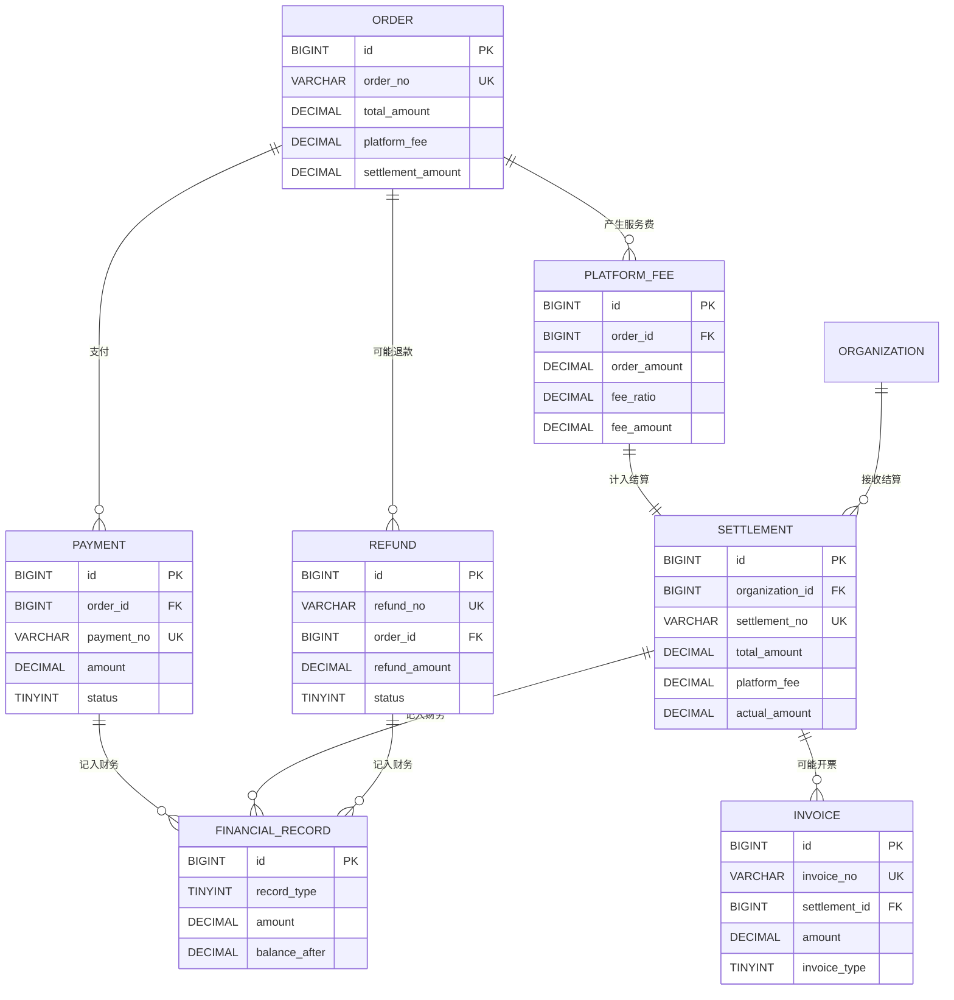

# 清如小程序 V2.0 - ER 图文档

**文档版本**: V1.0.0  
**创建日期**: 2026-04-16  
**设计依据**: PRD V2.0.0 + Stitch 设计系统

---

## 一、ER 图总览

### 1.1 完整 ER 图（Mermaid 格式）

```mermaid
erDiagram
    %% 用户体系
    USER ||--o{ USER_ROLE : has
    USER ||--o{ AUDIO_RECORD : listens
    USER ||--o{ CERTIFICATE : earns
    USER ||--o{ ZEN_FAVORITE : collects
    USER ||--o{ SELF_RECORD : submits
    USER ||--o{ CHECKIN : tracks
    USER ||--o{ ORDER : places
    USER ||--o{ MILESTONE_CERTIFICATE : achieves
    
    %% 角色体系
    USER_ROLE ||--o{ VOLUNTEER : extends
    USER_ROLE ||--o{ ORGANIZATION : extends
    
    %% 机构相关
    ORGANIZATION ||--o{ ORDER : undertakes
    ORGANIZATION ||--o{ VOLUNTEER : manages
    ORGANIZATION ||--o{ SETTLEMENT : receives
    ORGANIZATION ||--o{ ORGANIZATION_QUALIFICATION : has
    ORGANIZATION ||--o{ WATER_AREA_ORGANIZATION : cooperates
    
    %% 订单相关
    ORDER ||--o{ ORDER_ITEM : contains
    ORDER ||--o{ PAYMENT : has
    ORDER ||--o{ EXECUTION_TASK : generates
    ORDER ||--o{ SETTLEMENT : settles
    ORDER ||--o{ PLATFORM_FEE : generates
    ORDER ||--o{ REFUND : may_have
    ORDER ||--o{ FINANCIAL_RECORD : recorded_in
    ORDER ||--o{ INVOICE : may_have
    
    %% 志愿者相关
    VOLUNTEER ||--o{ EXECUTION_TASK : executes
    VOLUNTEER ||--o{ TASK_FEEDBACK : submits
    
    %% 任务相关
    EXECUTION_TASK ||--o{ TASK_FEEDBACK : contains
    
    %% 物种相关
    SPECIES ||--o{ SELF_RECORD : used_in
    SPECIES ||--o{ ORDER_ITEM : selected_in
    SPECIES }|--|| SPECIES_CATEGORY : belongs_to
    
    %% 水域相关
    WATER_AREA ||--o{ SELF_RECORD : used_in
    WATER_AREA ||--o{ ORDER : selected_in
    WATER_AREA ||--o{ WATER_AREA_ORGANIZATION : managed_by
    
    %% 内容体系
    AUDIO ||--o{ AUDIO_RECORD : played_in
    AUDIO ||--o{ MILESTONE_CERTIFICATE : triggers
    
    ZEN_CONTENT ||--o{ DAILY_ZEN : featured_as
    ZEN_CONTENT ||--o{ ZEN_FAVORITE : collected_in
    
    BUDDHIST_CALENDAR ||--o{ CHECKIN : associated_with
    
    %% 证书体系
    CERTIFICATE_TEMPLATE ||--o{ CERTIFICATE : generates
    MILESTONE_CERTIFICATE ||--|| CERTIFICATE : creates
    
    %% 财务体系
    SETTLEMENT ||--o{ INVOICE : may_have
    SETTLEMENT ||--o{ FINANCIAL_RECORD : recorded_in
    PLATFORM_FEE ||--|| SETTLEMENT : settled_in
    PAYMENT ||--o{ REFUND : may_have
    
    %% 表注释
    USER["用户基础表\nuser"]
    USER_ROLE["用户角色表\nuser_role"]
    VOLUNTEER["公益志愿者表\nvolunteer"]
    ORGANIZATION["合规执行机构表\norganization"]
    ORGANIZATION_QUALIFICATION["机构资质表\norganization_qualification"]
    
    SELF_RECORD["自主护生记录表\nself_record"]
    ORDER["委托护生订单表\norder"]
    ORDER_ITEM["订单明细表\norder_item"]
    PAYMENT["支付订单表\npayment"]
    EXECUTION_TASK["执行任务表\nexecution_task"]
    TASK_FEEDBACK["任务反馈表\ntask_feedback"]
    
    SPECIES["护生物种表\nspecies"]
    SPECIES_CATEGORY["物种分类表\nspecies_category"]
    WATER_AREA["合规水域表\nwater_area"]
    WATER_AREA_ORGANIZATION["水域机构关联表\nwater_area_organization"]
    
    AUDIO["梵音音频表\naudio"]
    AUDIO_RECORD["音频收听记录表\naudio_record"]
    ZEN_CONTENT["禅理内容表\nzen_content"]
    DAILY_ZEN["每日一禅表\ndaily_zen"]
    ZEN_FAVORITE["禅理收藏表\nzen_favorite"]
    BUDDHIST_CALENDAR["佛历吉日表\nbuddhist_calendar"]
    CHECKIN["修行打卡表\ncheckin"]
    
    CERTIFICATE_TEMPLATE["证书模板表\ncertificate_template"]
    CERTIFICATE["证书表\ncertificate"]
    MILESTONE_CERTIFICATE["里程碑证书表\nmilestone_certificate"]
    
    SETTLEMENT["机构结算单表\nsettlement"]
    PLATFORM_FEE["平台服务费表\nplatform_fee"]
    INVOICE["发票管理表\ninvoice"]
    FINANCIAL_RECORD["财务记录表\nfinancial_record"]
    REFUND["退款记录表\nrefund"]
```

---

## 二、核心业务关系

### 2.1 用户体系关系



**关系说明**:
- 1 个用户可拥有多个角色（祈福者、志愿者、机构管理员）
- 志愿者和机构是用户角色的扩展
- 志愿者可绑定到机构

---

### 2.2 护生订单全流程



**流程说明**:
1. 用户创建订单 → 订单明细
2. 用户支付订单 → 支付记录
3. 机构承接订单 → 生成执行任务
4. 志愿者执行任务 → 提交反馈
5. 用户确认完成 → 生成证书
6. 平台结算 → 机构结算单

---

### 2.3 自主护生记录



**流程说明**:
1. 用户选择物种和水域
2. 填写护生信息并提交
3. 系统自动生成证书

---

### 2.4 内容体系关系



**业务说明**:
- 音频收听记录有效收听（≥80% 时长）
- 收听里程碑自动触发证书生成
- 每日一禅从禅理内容池选取
- 佛历吉日关联修行打卡

---

### 2.5 财务结算体系



**财务流程**:
1. 订单支付 → 支付记录
2. 订单完成 → 计算平台服务费
3. 周期结算 → 生成结算单
4. 机构开票 → 发票管理
5. 所有流水 → 财务记录

---

## 三、数据关系详解

### 3.1 一对一关系（1:1）

| 主表 | 关联表 | 关系说明 |
|------|--------|----------|
| user | user_role | 1 个用户有 1 个主角色（但可有多个角色记录） |
| order | payment | 1 个订单对应 1 次支付（退款除外） |
| milestone_certificate | certificate | 1 个里程碑生成 1 个证书 |

### 3.2 一对多关系（1:N）

| 主表 | 关联表 | 关系说明 |
|------|--------|----------|
| user | order | 1 个用户可下多个订单 |
| user | audio_record | 1 个用户可有多条收听记录 |
| user | certificate | 1 个用户可获得多个证书 |
| user | self_record | 1 个用户可提交多条护生记录 |
| organization | order | 1 个机构可承接多个订单 |
| organization | volunteer | 1 个机构可管理多个志愿者 |
| order | order_item | 1 个订单可包含多个明细 |
| order | execution_task | 1 个订单可生成多个任务 |
| species | self_record | 1 个物种可用于多条记录 |
| species | order_item | 1 个物种可出现在多个订单中 |
| water_area | order | 1 个水域可被多个订单选择 |
| audio | audio_record | 1 个音频可被多次收听 |
| zen_content | daily_zen | 1 条禅理可被选为多日的每日一禅 |
| certificate_template | certificate | 1 个模板可生成多个证书 |

### 3.3 多对多关系（M:N）

| 表 A | 关联表 | 表 B | 关系说明 |
|------|--------|------|----------|
| water_area | water_area_organization | organization | 水域与机构合作关系 |
| user | zen_favorite | zen_content | 用户收藏禅理内容 |

---

## 四、关键业务链路

### 4.1 委托护生完整链路

```
USER（用户）
  ↓ 下单
ORDER（订单）
  ↓ 包含
ORDER_ITEM（订单明细）
  ↓ 支付
PAYMENT（支付记录）
  ↓ 机构承接
ORGANIZATION（机构）
  ↓ 分配任务
VOLUNTEER（志愿者）
  ↓ 执行
EXECUTION_TASK（执行任务）
  ↓ 提交反馈
TASK_FEEDBACK（任务反馈）
  ↓ 用户确认
ORDER（订单状态更新）
  ↓ 生成证书
CERTIFICATE（证书）
  ↓ 周期结算
SETTLEMENT（结算单）
  ↓ 财务记录
FINANCIAL_RECORD（财务记录）
```

### 4.2 自主护生链路

```
USER（用户）
  ↓ 选择
SPECIES（物种） + WATER_AREA（水域）
  ↓ 提交
SELF_RECORD（自主护生记录）
  ↓ 审核
SELF_RECORD.status = 1（已通过）
  ↓ 生成证书
CERTIFICATE（护生圆满证书）
```

### 4.3 梵音收听链路

```
USER（用户）
  ↓ 收听
AUDIO（音频）
  ↓ 记录
AUDIO_RECORD（收听记录）
  ↓ 判断有效收听
AUDIO_RECORD.is_effective = 1
  ↓ 累计次数
USER 总收听次数
  ↓ 达到里程碑
MILESTONE_CERTIFICATE（里程碑证书）
  ↓ 生成证书
CERTIFICATE（收听里程碑证书）
```

### 4.4 修行打卡链路

```
USER（用户）
  ↓ 查看
BUDDHIST_CALENDAR（佛历吉日）
  ↓ 点击打卡
CHECKIN（打卡记录）
  ↓ 累计天数
CHECKIN.continuous_days
  ↓ 生成证书
CERTIFICATE（修行打卡证书）
```

---

## 五、数据完整性约束

### 5.1 外键约束（应用层维护）

| 子表 | 子字段 | 父表 | 父字段 | 约束类型 |
|------|--------|------|--------|----------|
| user_role | user_id | user | id | 级联删除 |
| volunteer | user_id | user | id | 级联删除 |
| volunteer | organization_id | organization | id | 置空 |
| organization | user_id | user | id | 级联删除 |
| self_record | user_id | user | id | 级联删除 |
| self_record | species_id | species | id | 限制 |
| order | user_id | user | id | 级联删除 |
| order | organization_id | organization | id | 限制 |
| order_item | order_id | order | id | 级联删除 |
| payment | order_id | order | id | 级联删除 |
| execution_task | order_id | order | id | 级联删除 |
| execution_task | volunteer_id | volunteer | id | 限制 |
| audio_record | user_id | user | id | 级联删除 |
| audio_record | audio_id | audio | id | 限制 |
| certificate | user_id | user | id | 级联删除 |
| settlement | organization_id | organization | id | 限制 |

### 5.2 唯一约束

| 表名 | 字段 | 说明 |
|------|------|------|
| user | open_id | 微信 OpenID 唯一 |
| user | union_id | 微信 UnionID 唯一 |
| order | order_no | 订单编号唯一 |
| payment | payment_no | 支付流水号唯一 |
| payment | wechat_trade_no | 微信交易号唯一 |
| certificate | certificate_no | 证书编号唯一 |
| settlement | settlement_no | 结算单编号唯一 |
| invoice | invoice_no | 发票编号唯一 |
| refund | refund_no | 退款编号唯一 |
| daily_zen | zen_date | 每日唯一禅理 |
| buddhist_calendar | calendar_date | 每日唯一佛历 |
| checkin | user_id + checkin_date + checkin_type | 用户每日每类型唯一打卡 |
| zen_favorite | user_id + zen_content_id | 用户收藏唯一 |
| water_area_organization | water_area_id + organization_id | 水域机构合作唯一 |

---

## 六、索引优化建议

### 6.1 高频查询索引

| 表名 | 查询场景 | 推荐索引 |
|------|----------|----------|
| order | 按用户查订单 | idx_user_id |
| order | 按状态查订单 | idx_status |
| order | 按机构查订单 | idx_organization_id |
| order | 按时间范围查询 | idx_created_at |
| audio_record | 按用户查收听记录 | idx_user_id |
| audio_record | 按音频查收听记录 | idx_audio_id |
| audio_record | 按日期统计 | idx_listen_date |
| certificate | 按用户查证书 | idx_user_id |
| certificate | 按类型查证书 | idx_certificate_type |

### 6.2 组合索引建议

| 表名 | 字段组合 | 查询场景 |
|------|----------|----------|
| order | (user_id, status) | 用户查某状态订单 |
| order | (organization_id, status) | 机构查某状态订单 |
| audio_record | (user_id, audio_id) | 用户查某音频收听 |
| audio_record | (user_id, listen_date) | 用户按日期查收听 |
| checkin | (user_id, checkin_date) | 用户查某日打卡 |
| self_record | (user_id, record_date) | 用户按日期查记录 |

---

*清如 V2.0 · ER 图文档* 🌊
