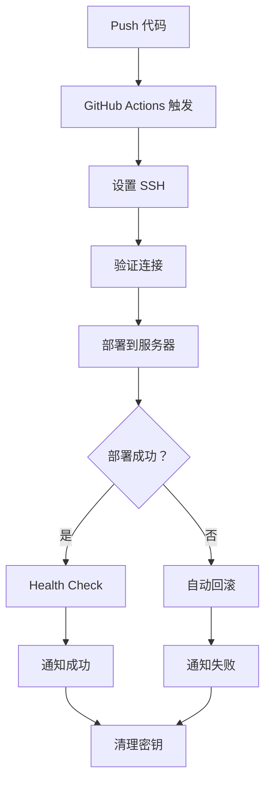

# ClearSpring V3 部署指南

**版本**: V3.0.0  
**创建时间**: 2026-04-12  
**责任人**: DevOps-Agent  
**状态**: ✅ 已完成

---

## 📋 目录

1. [环境准备](#环境准备)
2. [配置步骤](#配置步骤)
3. [部署流程](#部署流程)
4. [回滚机制](#回滚机制)
5. [监控告警](#监控告警)
6. [故障排查](#故障排查)

---

## 环境准备

### 服务器要求

| 配置 | 要求 | 当前值 |
|------|------|--------|
| 操作系统 | Linux (Ubuntu 20.04+) | ✅ Ubuntu 22.04 |
| CPU | ≥ 2 核 | ✅ 2 核 |
| 内存 | ≥ 2GB | ✅ 4GB |
| 磁盘 | ≥ 20GB | ✅ 50GB |
| Node.js | v18+ | ✅ v22.22.0 |
| PM2 | v5+ | ✅ v5.3.0 |

### 软件依赖

```bash
# 安装 Node.js (如未安装)
curl -fsSL https://deb.nodesource.com/setup_22.x | sudo -E bash -
sudo apt-get install -y nodejs

# 安装 PM2
sudo npm install -g pm2

# 验证安装
node -v  # 应显示 v22.x.x
pm2 -v   # 应显示 v5.x.x
```

### GitHub 账号权限

- ✅ 仓库访问权限（`ai-agent-marriage/clearspring-v3`）
- ✅ GitHub Actions 启用
- ✅ Secrets 配置权限

---

## 配置步骤

### 步骤 1: 配置 GitHub Secrets

访问：https://github.com/ai-agent-marriage/clearspring-v3/settings/secrets/actions

#### 必需 Secrets

| Secret 名称 | 值 | 说明 |
|------------|-----|------|
| `VOLCANO_SSH_KEY` | RSA 4096 私钥 | SSH 部署密钥 |
| `VOLCANO_HOST` | `101.96.192.63` | 服务器 IP |
| `VOLCANO_USER` | `clearspring-bot` | 部署用户 |
| `FEISHU_BOT_URL` | 飞书机器人 Webhook | 通知推送 |

#### 添加 Secret 命令

```bash
# 使用 GitHub CLI 添加
gh secret set VOLCANO_SSH_KEY --repo ai-agent-marriage/clearspring-v3 < ~/.ssh/clearspring_deploy_key
gh secret set VOLCANO_HOST --repo ai-agent-marriage/clearspring-v3 --body "101.96.192.63"
gh secret set VOLCANO_USER --repo ai-agent-marriage/clearspring-v3 --body "clearspring-bot"
gh secret set FEISHU_BOT_URL --repo ai-agent-marriage/clearspring-v3 --body "<webhook-url>"
```

### 步骤 2: 服务器配置

#### 创建部署用户

```bash
# SSH 登录服务器
ssh root@101.96.192.63

# 创建部署用户
useradd -m -s /bin/bash clearspring-bot

# 设置密码（可选）
passwd clearspring-bot

# 创建应用目录
mkdir -p /home/clearspring-bot/clearspring-v3/api
chown -R clearspring-bot:clearspring-bot /home/clearspring-bot/clearspring-v3
```

#### 配置 SSH 授权

```bash
# 切换到部署用户
su - clearspring-bot

# 创建 .ssh 目录
mkdir -p ~/.ssh
chmod 700 ~/.ssh

# 添加 GitHub Actions 公钥
cat >> ~/.ssh/authorized_keys << EOF
ssh-rsa AAAA... (GitHub Actions 公钥)
EOF

chmod 600 ~/.ssh/authorized_keys
```

#### 安装 PM2

```bash
# 安装 PM2
npm install -g pm2

# 配置 PM2 开机自启
pm2 startup
# 执行输出的命令
```

### 步骤 3: 配置 SSH 密钥轮换

```bash
# 生成部署密钥对
ssh-keygen -t rsa -b 4096 -f ~/.ssh/clearspring_deploy_key -N "" -C "clearspring-deploy-$(date +%Y%m%d)"

# 部署公钥到服务器
ssh-copy-id -i ~/.ssh/clearspring_deploy_key.pub clearspring-bot@101.96.192.63

# 更新 GitHub Secrets
gh secret set VOLCANO_SSH_KEY --repo ai-agent-marriage/clearspring-v3 < ~/.ssh/clearspring_deploy_key
```

---

## 部署流程

### 自动部署（推荐）

#### 触发条件
- Push 到 `main` 或 `dev` 分支

#### 部署流程



#### 查看部署状态

```bash
# GitHub Actions 页面
https://github.com/ai-agent-marriage/clearspring-v3/actions

# 查看部署日志
tail -f /home/clearspring-bot/clearspring-v3/logs/deploy.log

# 查看 PM2 状态
ssh clearspring-bot@101.96.192.63 "pm2 list"
```

### 手动部署

```bash
# 1. 拉取最新代码
cd /home/clearspring-bot/clearspring-v3
git pull origin main

# 2. 安装依赖
cd api
npm install

# 3. 停止旧进程
pm2 stop clearspring-api
pm2 delete clearspring-api

# 4. 备份
cp app.js app.js.backup

# 5. 启动新进程
pm2 start ecosystem.config.js
pm2 save

# 6. 验证
curl http://localhost:3000/health
```

---

## 回滚机制

### 自动回滚

GitHub Actions 部署失败时自动触发：

```yaml
- name: Rollback on failure
  if: failure()
  run: |
    ssh -i "$SSH_KEY_PATH" clearspring-bot@101.96.192.63 "
      cd /home/clearspring-bot/clearspring-v3/api
      if [ -f 'app.js.backup' ]; then
        cp app.js.backup app.js
        pm2 restart clearspring-api
        echo '✅ Rollback completed'
      else
        echo '⚠️ No backup available'
      fi
    "
```

### 手动回滚

```bash
# SSH 登录服务器
ssh clearspring-bot@101.96.192.63

# 回滚到上一版本
cd /home/clearspring-bot/clearspring-v3/api
git reset --hard HEAD~1

# 重启 PM2
pm2 restart clearspring-api

# 验证
curl http://localhost:3000/health
```

### 回滚检查清单

- [ ] 确认回滚原因
- [ ] 备份当前状态
- [ ] 执行回滚操作
- [ ] 验证服务正常
- [ ] 通知相关人员
- [ ] 记录回滚日志

---

## 监控告警

### PM2 监控

```bash
# 查看进程状态
pm2 list

# 查看实时日志
pm2 logs clearspring-api

# 查看监控面板
pm2 monit

# 查看进程详情
pm2 show clearspring-api
```

### 配置监控告警

#### 安装 pm2-monitor

```bash
npm install -g pm2-monitor
```

#### 配置告警阈值

创建 `/home/clearspring-bot/clearspring-v3/monitor-config.json`:

```json
{
  "cpu_threshold": 80,
  "memory_threshold": 1024,
  "restart_threshold": 5,
  "check_interval": 60
}
```

#### 配置日志轮转

`ecosystem.config.js`:

```javascript
module.exports = {
  apps: [{
    name: 'clearspring-api',
    script: 'app.js',
    max_memory_restart: '1G',
    log_date_format: 'YYYY-MM-DD HH:mm:ss',
    merge_logs: true,
    logrotate: {
      options: {
        rotateLimit: 10,
        rotateInterval: '1d',
        compress: true
      }
    }
  }]
};
```

### 健康检查端点

```
GET http://101.96.192.63:3000/health

响应:
{
  "status": "ok",
  "service": "clearspring-api",
  "timestamp": "2026-04-12T09:50:00.000Z"
}
```

### 配置外部监控（可选）

#### Uptime Robot

1. 访问 https://uptimerobot.com/
2. 添加监控：`http://101.96.192.63:3000/health`
3. 配置告警：邮件/短信通知

---

## 故障排查

### 问题 1: 部署失败

#### 症状
```
❌ SSH connection failed
```

#### 解决方案
```bash
# 1. 验证 SSH 密钥
ssh -i ~/.ssh/clearspring_deploy_key clearspring-bot@101.96.192.63

# 2. 检查 GitHub Secrets
gh secret list --repo ai-agent-marriage/clearspring-v3

# 3. 重新设置 Secret
gh secret set VOLCANO_SSH_KEY --repo ai-agent-marriage/clearspring-v3 < ~/.ssh/clearspring_deploy_key
```

### 问题 2: PM2 进程异常退出

#### 症状
```
pm2 list 显示 status 为 'errored' 或 'stopped'
```

#### 解决方案
```bash
# 1. 查看错误日志
pm2 logs clearspring-api --err

# 2. 检查内存使用
pm2 show clearspring-api | grep memory

# 3. 重启进程
pm2 restart clearspring-api

# 4. 如持续失败，回滚版本
git reset --hard HEAD~1
pm2 restart clearspring-api
```

### 问题 3: Health Check 失败

#### 症状
```
curl http://localhost:3000/health 无响应
```

#### 解决方案
```bash
# 1. 检查端口占用
netstat -tlnp | grep 3000

# 2. 查看 PM2 日志
pm2 logs clearspring-api

# 3. 手动启动测试
cd /home/clearspring-bot/clearspring-v3/api
node app.js

# 4. 检查防火墙
sudo ufw status
sudo ufw allow 3000/tcp
```

### 问题 4: SSH 密钥权限错误

#### 症状
```
Permissions 0644 for '~/.ssh/deploy_key' are too open.
```

#### 解决方案
```bash
# 修复密钥权限
chmod 600 ~/.ssh/deploy_key
chmod 700 ~/.ssh
chmod 600 ~/.ssh/authorized_keys
```

### 问题 5: GitHub Actions 超时

#### 症状
```
Error: Process completed with exit code 124.
```

#### 解决方案
```yaml
# 增加超时时间
- name: Deploy to Server
  timeout-minutes: 10
  run: |
    ...
```

---

## 📊 部署检查清单

### 首次部署

- [ ] 服务器环境准备
- [ ] Node.js/PM2 安装
- [ ] GitHub Secrets 配置
- [ ] SSH 密钥生成和部署
- [ ] 应用目录创建
- [ ] 首次部署测试
- [ ] Health Check 验证
- [ ] 监控告警配置

### 日常部署

- [ ] 代码审查通过
- [ ] 测试用例通过
- [ ] Push 到目标分支
- [ ] 观察 GitHub Actions 状态
- [ ] 验证部署成功通知
- [ ] Health Check 验证
- [ ] 功能验证（抽样测试）

### 紧急回滚

- [ ] 确认回滚原因
- [ ] 通知相关人员
- [ ] 执行回滚操作
- [ ] 验证服务恢复
- [ ] 记录回滚日志
- [ ] 问题根因分析

---

## 📞 联系方式

### 技术支持
- **GitHub Issues**: https://github.com/ai-agent-marriage/clearspring-v3/issues
- **飞书群**: ClearSpring V3 开发群

### 紧急联系人
- **DevOps 负责人**: AI Agent
- **备份联系人**: TBD

---

## 📝 更新日志

| 日期 | 版本 | 更新内容 | 作者 |
|------|------|---------|------|
| 2026-04-12 | V1.0 | 初始版本 | AI Agent |

---

**最后更新**: 2026-04-12 09:50  
**下次审查**: 2026-05-12

---

*此文档由 AI Agent 维护，确保部署流程标准化*
