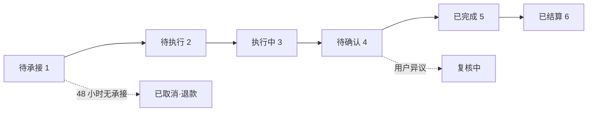

# 清如 V3 产品需求文档 PRD V2.0.0

> 文档编号：PRD-QINGRU-MINI-V2.0.0  
> 文档版本：V2.0.0  
> 保密等级：内部受控

---

## 📊 文档版本历史

| 版本号 | 修订日期 | 修订内容 | 修订人 |
|--------|----------|----------|--------|
| V1.0.0 | 2026-04-04 | 完成 PRD 初稿，覆盖三大核心板块基础功能、双角色体系、全流程功能需求 | 产品部 |
| V2.0.0 | 2026-04-04 | 1. 补充完整护生订单双链路闭环<br>2. 完善践行者双轨体系<br>3. 新增 WEB 管理平台全模块<br>4. 落地 Stitch 设计系统<br>5. 补充业务流程图<br>6. 优化合规方案与盈利模式 | 产品部 |

---

## 🎯 一、需求概述

### 1.1 项目背景与产品概述

**「清如」**是一款主打**禅意静心、科学护生**的微信小程序，以"**积善成德，虚极静笃**"为核心理念。

**核心服务**:
- 🎵 禅意音频播放（梵音）
- 📖 正念国学内容（禅理）
- 🐟 科学护生科普与公益记录服务
- 👷 护生执行端专属管理（订单承接/现场执行/合规管理）

**合规定位**:
- 弱化宗教属性，强化**生态保护、正念静心**的正向价值
- 全流程将"放生"替换为"**科学护生/生态放流**"
- 通过合规包装实现商业闭环

---

### 1.2 产品目标

#### 短期目标（上线 1-3 个月）
- ✅ 完成核心功能落地，顺利通过微信小程序审核
- ✅ 积累 1000+ 种子用户
- ✅ 核心功能使用率≥60%
- ✅ 跑通护生委托服务全流程闭环

#### 中期目标（上线 3-6 个月）
- ✅ 完善内容体系，打造科学护生垂直场景差异化优势
- ✅ 用户月留存率≥40%
- ✅ 付费委托订单月转化率≥15%

#### 长期目标
- ✅ 成为国内垂直于正念静心、科学护生领域的标杆小程序
- ✅ 构建"内容 - 服务 - 公益 - 记录"的完整用户闭环
- ✅ 形成合规可持续的商业模式

---

### 1.3 产品风险与应对措施

| 风险类型 | 风险描述 | 应对措施 |
|----------|----------|----------|
| **小程序审核风险** | 微信小程序对宗教相关、放生类内容有严格审核规则 | 1. 全流程替换为"科学护生"<br>2. 付费入口深度隐藏<br>3. 全页面固定合规提示<br>4. 入侵物种红标警示<br>5. 弱化宗教传教内容 |
| **内容合规风险** | 禅理内容、用户上传内容存在违规风险 | 1. 优先选用国学正念内容<br>2. 接入微信内容安全 API<br>3. 建立人工二次审核<br>4. 搭建敏感词库 |
| **用户隐私风险** | 微信授权、个人信息收集合规风险 | 1. 遵循《个人信息保护法》<br>2. 不强制注册授权<br>3. 公示用户协议与隐私政策<br>4. 敏感信息加密存储 |
| **合规执行风险** | 护生执行端出现违规行为 | 1. 机构必须具備合规资质<br>2. 全流程强制合规承诺<br>3. 建立黑白名单制度<br>4. 全流程记录永久归档 |

---

## 📋 二、产品描述

### 2.1 名词解释

| 名词 | 详细解释 |
|------|----------|
| **梵音** | 小程序内固定的 9 首经典禅意静心音频，是产品核心基础功能 |
| **有效收听** | 单首梵音单次播放时长≥总时长的 80%，记为 1 次有效收听 |
| **祈福者** | 小程序默认用户身份，免注册可使用基础功能 |
| **公益志愿者** | 护生行动现场执行人员，通过微信实名认证 + 合规承诺即可注册 |
| **合规执行机构** | 具备水生生物增殖放流相关资质的企业/公益组织，是唯一可承接用户付费委托订单的主体 |
| **每日一禅** | 小程序每日更新的正念禅理短句，支持生成海报分享 |
| **科学护生** | 原"放生"的合规替换表述，指严格遵循法律法规的生态保护公益行为 |
| **自主护生登记** | 祈福者自行完成护生行动后，在小程序内免费登记的公益记录功能 |
| **委托护生服务** | 祈福者委托合规执行机构完成科学护生执行的付费服务，是产品核心盈利模块 |
| **护生圆满证书** | 用户完成护生行动、梵音收听里程碑后，系统自动生成的电子证书 |
| **护生功德林** | 护生相关功能的统一承载入口 |

---

### 2.2 核心功能列表（Feature List）

#### 公共模块
| 功能模块 | 子功能 | 功能描述 | 优先级 |
|----------|--------|----------|--------|
| 底部导航 | 导航栏 | 展示固定 3 个 tab：梵音、禅理、我的 | P0 |

#### 梵音板块
| 功能模块 | 子功能 | 功能描述 | 优先级 |
|----------|--------|----------|--------|
| 首页展示 | 随机禅理展示 | 每次加载随机展示 1 句禅理短句 | P0 |
| 音频分类 | 9 首固定梵音 | 固定 9 个不可修改的音频分类按钮 | P0 |
| 音频播放 | 核心播放控制 | 播放/暂停、音量调节、环形进度条 | P0 |
| 播放状态 | 状态记忆 | 自动记忆上次播放的音频与进度 | P1 |
| 后台保活 | 后台播放 | 小程序切到后台、锁屏时可继续播放 | P0 |
| 数据统计 | 有效收听统计 | 统计单首/总梵音的有效收听次数 | P0 |
| 里程碑 | 收听里程碑提示 | 达到里程碑时弹出提示，生成证书 | P1 |
| 注册引导 | 场景触发 | 收听满 5 次/总收听满 10 次触发 | P1 |

#### 禅理板块
| 功能模块 | 子功能 | 功能描述 | 优先级 |
|----------|--------|----------|--------|
| 双首页交互 | 首页 1 随机禅理 | 全屏展示随机禅理短句，水墨国风背景 | P0 |
| 滑动切换 | 上滑/下滑交互 | 首页 1 与首页 2 平滑切换 | P0 |
| 每日一禅 | 内容展示 | 每日更新禅理短句，支持背景切换 | P0 |
| 分享功能 | 4 种分享方式 | 微信好友/朋友圈/保存图片/复制链接 | P0 |
| 物种查询 | 分类列表 | 按分类展示物种，支持搜索 | P0 |
| 合规标识 | 可投放/禁止投放 | 入侵物种红标强警示 | P0 |
| 物种详情 | 详细信息 | 学名、保护级别、生态属性等 | P0 |
| 佛历吉日 | 日历展示 | 公历 + 佛历双轨日历 | P0 |
| 宜忌禅理 | 宜忌事项 + 禅理 | 分区域展示，固定当日专属禅理 | P0 |
| 打卡跳转 | 晨起/晚间打卡 | 跳转梵音板块对应音频 | P0 |
| 护生功德林 | 自主护生登记 | 免费，默认展示，合规核心 | P0 |
| 护生功德林 | 委托护生服务 | 付费，隐藏二级入口，盈利核心 | P0 |
| 功德证书 | 证书列表 | 按时间倒序展示所有证书 | P0 |

#### 我的板块（祈福者端）
| 功能模块 | 子功能 | 功能描述 | 优先级 |
|----------|--------|----------|--------|
| 免注册页面 | 基础功能 | 本地收听记录、收藏夹、科普专区 | P0 |
| 注册后页面 | 个人信息管理 | 微信头像、昵称、个性签名 | P0 |
| 修行数据 | 数据看板 | 累计收听次数、护生次数、打卡天数、证书数量 | P0 |
| 全量功能 | 同步前端板块 | 梵音/禅理/证书相关全量功能 | P0 |

#### 我的板块（践行者端 - 志愿者）
| 功能模块 | 子功能 | 功能描述 | 优先级 |
|----------|--------|----------|--------|
| 注册审核 | 实名认证 + 合规承诺 | 系统自动审核通过 | P0 |
| 数据看板 | 任务数据统计 | 待执行/已完成任务数、服务时长 | P0 |
| 任务管理 | 全生命周期管理 | 待执行/执行中/已完成任务 | P0 |

#### 我的板块（践行者端 - 机构）
| 功能模块 | 子功能 | 功能描述 | 优先级 |
|----------|--------|----------|--------|
| 注册审核 | 资质审核 | 平台人工审核通过 | P0 |
| 数据看板 | 订单数据统计 | 待承接/待执行/待确认订单数 | P0 |
| 订单管理 | 全流程管理 | 承接/执行/审核/归档 | P0 |
| 志愿者管理 | 团队管理 | 邀请码/绑定/分配任务 | P0 |
| 结算管理 | 结算记录 | 待结算/结算记录/发票 | P0 |

#### WEB 管理平台
| 功能模块 | 子功能 | 功能描述 | 优先级 |
|----------|--------|----------|--------|
| 控制台 | 数据大盘 | 核心数据、待办事项、趋势图 | P0 |
| 用户管理 | 全生命周期管理 | 祈福者/志愿者/机构管理 | P0 |
| 订单管理 | 全流程管控 | 查看/审核/驳回/状态修改 | P0 |
| 内容管理 | 禅理/物种/证书 | 配置管理 + 内容审核 | P0 |
| 财务管理 | 对账/结算/发票 | 订单对账、平台服务费、结算 | P0 |
| 系统设置 | 基础配置 | 小程序/支付/消息/日志 | P1 |

---

## 🎨 三、全局设计规范（Stitch 设计系统）

### 3.1 色彩体系规范

| 色彩类型 | 色值 | 应用场景 |
|----------|------|----------|
| **主色** | `#4A5D4E`（低饱和森系墨绿） | 核心 CTA 按钮、导航栏选中态、标题强调色 |
| **辅助色** | `#C9B037`（哑光金） | 里程碑标签、证书点缀、高亮提示 |
| **第三色** | `#A68966`（暖棕褐） | 次要按钮、辅助描边、辅助文字 |
| **中性底色** | `#EFEEE9`（浅奶油米白） | 全页面通用背景色 |
| **成功状态色** | `#38A169` | 完成态标签、成功提示、合规标识 |
| **错误/警示状态色** | `#E53E3E` | 禁止投放标识、错误提示、违规警示 |
| **警告状态色** | `#ECC94B` | 待办提醒、超时提示 |
| **文本主色** | `#2D3748` | 标题、正文核心文本 |
| **文本辅助色** | `#718096` | 提示文案、备注、次要信息 |

---

### 3.2 字体与排版规范

| 字体层级 | 字体 | 字号（小程序 rpx/WEB px） | 字重 | 应用场景 |
|----------|------|--------------------------|------|----------|
| 一级标题 | Noto Serif | 36rpx / 24px | 700 | 页面主标题、核心模块标题 |
| 二级标题 | Noto Serif | 32rpx / 20px | 600 | 子模块标题、卡片标题 |
| 三级标题 | Plus Jakarta Sans | 28rpx / 18px | 600 | 列表项标题、按钮文字 |
| 正文 | Plus Jakarta Sans | 26rpx / 16px | 400 | 表单文本、详情内容 |
| 辅助文本 | Plus Jakarta Sans | 24rpx / 14px | 400 | 提示文案、时间戳 |

---

### 3.3 组件与交互规范

| 组件类型 | 规范详情 |
|----------|----------|
| **圆角规范** | 全页面控件统一使用中等圆角（Level 2），按钮/卡片圆角 8rpx/4px |
| **间距规范** | 模块间距 32rpx/16px，元素内边距 24rpx/12px，内容间距 16rpx/8px |
| **按钮交互** | 常态：主色填充 + 白色文字；hover 态：主色加深 10%；禁用态：灰色背景 |
| **卡片交互** | 常态：白色底色 + 极淡软投影（opacity 8%）；hover 态：投影加深 |
| **弹窗交互** | 操作类：从底部上滑弹出；提示/确认类：居中淡入弹出 |
| **加载状态** | 列表页使用骨架屏，按钮使用加载态替换文字 |
| **表单校验** | 实时校验（输入失焦后触发），错误提示红色文字 + 图标 |

---

### 3.4 适配与布局规范

#### 小程序端
- 使用**rpx 弹性布局**，兼容微信小程序全机型
- 适配全面屏底部安全区域，兼容折叠屏横竖屏切换
- 图片使用**webp 格式**，懒加载模式
- 海报生成尺寸适配微信朋友圈**9:16 比例**

#### WEB 管理平台
- **响应式布局**，设置 1200px（桌面端）、768px（平板端）两个断点
- 最小适配宽度**1366px**，核心内容区固定宽度 1200px 居中
- 兼容 Chrome 90+/Firefox 88+/Edge 90+ 浏览器

---

## 📱 四、功能需求详情

### 4.1 公共模块：底部导航栏

**功能描述**: 用户进入小程序后，所有页面底部固定展示导航栏

**业务规则**:
- ✅ 导航栏固定 3 个 tab：梵音、禅理、我的
- ✅ 每个 tab 包含线性图标 + 文字，选中态为`#4A5D4E`，未选中为`#333333`
- ✅ 践行者身份登录后，底部导航栏不变，仅「我的」页面切换为对应工作台
- ✅ 导航栏不随页面滑动隐藏，全页面常驻展示

---

### 4.2 梵音板块

#### 4.2.1 首页展示

**核心功能**:
- ✅ 顶部 Noto Serif 字体展示随机禅理短句
- ✅ 下方展示 9 个固定的梵音分类按钮
- ✅ 分类按钮右下角角标展示累计有效收听次数
- ✅ 点击任意分类按钮，直接跳转到对应音频的播放界面

**业务规则**:
- ✅ 9 个梵音分类固定不可修改、不可新增
- ✅ 禅理短句与禅理板块共用内容池
- ✅ 免注册用户的收听次数仅本地缓存，注册用户云端同步

---

#### 4.2.2 音频播放功能

**核心功能**:
- ✅ 自动开始播放对应音频，环形进度条同步展示播放进度
- ✅ 页面中间实时展示当前已播放时长
- ✅ 核心控制区仅保留「暂停/播放」主按钮
- ✅ 音量调节条支持左右滑动
- ✅ 音频播放完成后，自动暂停并复位进度条

**业务规则**:
- ✅ 仅支持当前选中的音频播放，无上下曲切换功能
- ✅ 音频默认音量为系统媒体音量的 70%
- ✅ 播放界面背景使用低透明度水墨禅意元素点缀

---

#### 4.2.3 收听统计功能

**核心功能**:
- ✅ 有效收听完成后，同步更新该音频的角标次数与总收听次数
- ✅ 单首/总收听次数达到 10/100/1000 次等整数里程碑时，弹出无打扰提示
- ✅ 里程碑达成后，自动生成对应收听里程碑证书

**业务规则**:
- ✅ 同一音频 1 小时内重复播放，最多记 1 次有效收听
- ✅ 收听次数统计仅统计有效收听，快进、暂停后重复播放不计入
- ✅ 证书模板支持 WEB 后台配置更新

---

### 4.3 禅理板块

#### 4.3.1 双首页交互

**核心功能**:
- ✅ 进入板块后，优先加载首页 1，全屏展示随机禅理短句
- ✅ 用户向上滑动页面，平滑过渡到首页 2，展示四大核心功能入口
- ✅ 用户在首页 2 向下滑动页面，可平滑返回首页 1
- ✅ 首页 1 的禅理短句支持点击刷新、一键收藏

**业务规则**:
- ✅ 每次进入禅理板块，首页 1 的禅理短句自动刷新
- ✅ 滑动切换动画时长 300ms，平滑无卡顿
- ✅ 首页 2 四大功能入口固定顺序：每日一禅、物种查询、佛历吉日、功德证书

---

#### 4.3.2 每日一禅功能

**核心功能**:
- ✅ 分享页默认展示当日禅理短句，搭配默认背景图
- ✅ 用户左右滑动卡片，可切换预制的多款背景图
- ✅ 用户点击分享按钮，唤起分享弹出层，提供 4 个选项：微信好友/朋友圈/保存图片/复制链接
- ✅ 生成的海报自动适配微信朋友圈尺寸（1080×1920px）

**业务规则**:
- ✅ 背景图按「山水禅意、水墨国风、极简静修、护生生态」分类预制
- ✅ 生成的海报高清无水印
- ✅ 禅理文案内容接入微信内容安全 API

---

#### 4.3.3 物种查询功能

**核心功能**:
- ✅ 列表页顶部展示搜索框，支持按物种名称、学名、俗称搜索
- ✅ 搜索框下方展示分类标签：全部分类、鱼类、鸟类、两栖类、爬行类
- ✅ 物种列表用卡片展示，每个卡片标注「可合规投放」「禁止投放」醒目标签
- ✅ 用户点击物种卡片，进入物种详情页

**业务规则**:
- ✅ 物种信息、合规要求支持 WEB 后台统一配置更新
- ✅ 所有物种必须明确标注可投放/禁止投放属性
- ✅ 详情页固定展示科学护生合规提示
- ✅ 禁止投放物种不可在护生登记/委托单中被选中

---

#### 4.3.4 佛历吉日功能

**核心功能**:
- ✅ 页面顶部展示当前日期的公历、佛历、干支信息
- ✅ 日历视图可按月份切换
- ✅ 日历下方分「宜」「忌」两个区域，展示当日宜忌事项
- ✅ 宜忌下方固定展示当日专属禅理短句
- ✅ 页面中部展示「晨起礼佛」「晚间打坐」两个按钮，点击后直接跳转梵音板块对应音频
- ✅ 按钮下方展示打卡累计天数

**业务规则**:
- ✅ 佛历、宜忌信息支持 WEB 后台统一配置更新
- ✅ 同一用户当日同一打卡按钮，仅可记录 1 次有效打卡
- ✅ 可对打卡设置提醒，到点推送微信订阅消息给用户
- ✅ 宜忌内容优先展示生态护生、正念修身相关事项

---

#### 4.3.5 护生功德林功能

##### 子功能 1：自主护生登记（免费，默认展示）

**核心流程**:
1. 用户点击「发起自主护生登记」按钮，首先弹出《科学护生合规承诺书》
2. 用户必须勾选合规承诺，才可进入下一步
3. 用户进入信息填写页：护生日期、投放水域、护生物种、投放数量、现场照片、护生心愿
4. 填写完成后点击「提交护生记录」，弹出二次确认弹窗
5. 提交成功后，自动弹出「护生圆满证书」，提供保存、分享按钮

**业务规则**:
- ✅ 免注册用户可使用基础登记功能，记录仅本地缓存
- ✅ 注册用户的记录云端永久同步
- ✅ 提交后的记录 3 天内支持编辑修改，超过 3 天仅可查看
- ✅ 物种选择器仅可选择「可合规投放物种」
- ✅ 用户上传的照片接入微信内容安全 API 自动审核

---

##### 子功能 2：委托护生服务（付费，隐藏二级入口）

**核心流程**:
1. 页面顶部固定滚动展示《科学护生委托服务合规声明》
2. 用户点击「发起护生委托」，强制弹出二次合规承诺书
3. 用户填写委托单信息：护生执行日期、执行水域、护生物种与规格、增值服务、护生心愿寄语、委托方信息
4. 填写完成后点击「确认委托单」，进入订单确认页
5. 用户必须勾选同意《委托服务协议》，才可点击「提交委托单并支付」
6. 唤起微信支付完成付款
7. 支付成功后，系统生成唯一订单编号，订单状态标记为「待机构承接」
8. 机构承接、执行、提交执行材料后，用户收到通知
9. 用户确认执行结果无误后，点击「确认圆满完成」，系统自动生成专属护生圆满证书

**业务规则**:
- ✅ 小程序端全程不展示「平台服务费、分佣、利润」相关内容
- ✅ 所有定价、物种、水域、增值服务，仅可在 WEB 后台配置
- ✅ 绝对禁止未成年人支付，接入微信支付未成年人限制
- ✅ 执行日期仅可选择未来 7-30 天内的日期，不可选当日及过去日期
- ✅ 支付失败，订单保留 15 分钟未支付自动取消
- ✅ 48 小时无机构承接订单，系统自动取消订单，全额原路退款

**订单状态流转**:
```
待承接 (1) → 待执行 (2) → 执行中 (3) → 待确认 (4) → 已完成 (5) → 已结算 (6)
```

---

### 4.4 我的板块（祈福者端）

#### 4.4.1 免注册默认页面

**核心功能**:
- ✅ 页面顶部展示品牌名「清如」、slogan「积善成德，虚极静笃」
- ✅ 中间功能区展示 4 个入口：本地收听记录、本地收藏夹、护生科普专区、常见问题与反馈
- ✅ 左下角为系统设置入口，仅保留「推送通知开关」「缓存清理」2 项功能
- ✅ 右下角固定「践行者入口」按钮

**业务规则**:
- ✅ 免注册用户的收听记录、收藏内容仅本地缓存
- ✅ 页面无固定的祈福者注册按钮，注册引导仅在特定场景触发
- ✅ 常见问题内固定展示用户协议、隐私政策、科学护生合规声明入口

---

#### 4.4.2 注册后全量功能页面

**核心功能**:
- ✅ 页面顶部展示用户微信头像、昵称、「祈福者」身份标识
- ✅ 核心数据看板展示 4 项修行数据：累计梵音收听次数、累计护生行动次数、连续修行打卡天数、累计获得证书数量
- ✅ 功能区分 4 组，与前端板块完全同步：
  - 梵音相关：我的收听明细、我的收藏佛乐、收听里程碑记录
  - 禅理相关：我的护生台账、我的修行打卡日历、我的禅理收藏
  - 证书相关：我的证书库、修行里程碑汇总
  - 通用功能：我的分享记录、护生科普专区、意见反馈、常见问题
- ✅ 页面底部展示系统设置、账号与安全、合规公示入口

**业务规则**:
- ✅ 所有数据与梵音、禅理板块实时同步
- ✅ 个人资料仅支持修改昵称、个性签名
- ✅ 账号注销功能需满足微信小程序规范

---

### 4.5 我的板块（践行者端 - 公益志愿者）

**核心功能**:
- ✅ 页面顶部展示志愿者姓名、「公益志愿者」身份标识、实名认证状态
- ✅ 核心数据看板展示：待执行任务数、已圆满完成任务数、累计公益服务时长、合规执行率
- ✅ 核心任务管理 Tab 栏，固定 3 个标签：待执行任务、执行中任务、已完成任务
- ✅ 待执行任务列表展示机构分配的任务，支持查看详情、确认接收、申请无法执行
- ✅ 执行中任务列表支持提交执行反馈、上传现场材料、签署合规承诺
- ✅ 已完成任务列表支持查看详情、审核结果、对应公益证书

**业务规则**:
- ✅ 仅可查看、操作分配给本人的任务
- ✅ 全程无任何资金、结算、定价相关内容展示
- ✅ 必须在约定执行日期后 24 小时内提交执行材料
- ✅ 多次提交违规/虚假材料的志愿者，账号永久封禁

---

### 4.6 我的板块（践行者端 - 合规执行机构）

**核心功能**:
- ✅ 页面顶部展示机构名称、「合规执行机构」身份标识、审核状态
- ✅ 核心数据看板展示：待承接订单数、今日待执行订单数、待用户确认订单数、累计圆满执行订单数
- ✅ 核心订单管理 Tab 栏，固定 5 个标签：待承接订单、待执行订单、执行中订单、待用户确认订单、已完成订单
- ✅ 核心配套模块：
  - 志愿者团队管理：生成邀请码、绑定志愿者、分配执行任务
  - 执行管理：合规点位管理、执行台账统计、合规知识库
  - 结算管理：待结算订单、结算记录、发票管理
  - 资质管理：机构信息编辑、资质文件更新、提交平台审核

**业务规则**:
- ✅ 仅可承接本机构资质对应水域的订单
- ✅ 结算管理模块仅展示本机构的结算数据，看不到平台服务费比例
- ✅ 机构资质到期未更新的，自动暂停接单权限

---

## 🖥️ 五、WEB 管理平台功能需求

### 5.1 平台角色与权限体系

| 角色 | 核心权限范围 | 禁止权限 |
|------|--------------|----------|
| **平台超级管理员** | 全后台所有功能权限 | 无 |
| **机构管理员** | 仅可查看本机构的订单、执行、志愿者、结算、资质管理 | 不可查看其他机构数据、平台用户全量数据、平台配置 |
| **内容运营专员** | 仅可操作内容管理、禅理内容配置、物种库管理、证书模板管理 | 不可查看用户隐私数据、财务管理 |
| **合规审核专员** | 仅可操作用户资质审核、订单合规审核、内容审核、违规处理 | 不可操作财务管理、系统配置 |
| **财务专员** | 仅可操作订单对账、结算管理、发票管理、财务报表导出 | 不可修改平台配置、操作用户管理 |

---

### 5.2 超级管理员后台全模块功能

#### 5.2.1 控制台首页

**核心数据大盘**:
- ✅ 小程序核心数据：累计注册用户数、日活、月活、新增用户数、7 日留存率、30 日留存率
- ✅ 订单核心数据：累计委托订单数、今日订单数、订单完成率、累计委托金总额、累计平台营收、客单价
- ✅ 合规数据：内容审核通过率、订单合规率、违规驳回数、账号封禁数

**待办事项提醒**:
- ✅ 待审核机构资质、待审核订单、待处理用户投诉、待结算订单、待审核发票

**运营数据趋势图**:
- ✅ 订单量、营收、用户增长的日/周/月趋势折线图/柱状图

---

#### 5.2.2 用户管理模块

**祈福者用户管理**:
- ✅ 用户列表：展示用户 ID、昵称、手机号、注册时间、累计订单数、累计消费金额、账号状态
- ✅ 支持按用户 ID、昵称、手机号、注册时间、账号状态筛选查询
- ✅ 操作功能：查看用户详情、订单记录、修行数据、封禁/解封账号、重置密码

**公益志愿者管理**:
- ✅ 志愿者列表：展示志愿者 ID、姓名、实名认证状态、绑定机构、注册时间、累计执行任务数、合规执行率
- ✅ 操作功能：查看志愿者详情、执行记录、强制解除机构绑定、封禁/解封账号

**机构用户管理**:
- ✅ 机构列表：展示机构 ID、名称、统一社会信用代码、审核状态、注册时间、累计执行订单数
- ✅ 资质审核功能：查看机构提交的资质文件，支持「审核通过」「审核驳回」操作
- ✅ 操作功能：查看机构详情、订单记录、调整机构可执行水域、配置机构结算规则

---

#### 5.2.3 订单全流程管理模块

**委托订单全量管理**:
- ✅ 订单列表：展示平台所有委托订单，包含订单编号、用户信息、承接机构、订单状态、委托金总额
- ✅ 支持按订单编号、用户 ID、机构 ID、订单状态、下单时间、金额范围筛选查询
- ✅ 订单详情查看：可查看订单完整信息、支付记录、执行材料、用户确认记录、证书信息
- ✅ 订单管控操作：违规订单驳回（触发全额退款）、订单状态手动修改、用户投诉处理

**自主护生记录管理**:
- ✅ 列表展示用户提交的所有自主护生记录，支持查看详情、审核通过/驳回、隐藏违规记录

---

#### 5.2.4 内容与合规管理模块

**内容管理**:
- ✅ 禅理内容池管理：新增、编辑、删除、上下架禅理短句，配置每日一禅内容
- ✅ 物种库管理：新增、编辑、删除物种信息，配置可投放/禁止投放属性、物种详情、规格、定价
- ✅ 合规水域管理：新增、编辑、删除合规投放水域，配置对应合作机构、资质信息
- ✅ 证书模板管理：新增、编辑、修改证书模板，配置证书样式、填充字段

**合规审核管理**:
- ✅ 内容审核池：用户上传的图片、文字、心愿寄语、自定义分享文案的审核列表
- ✅ 敏感词管理：配置平台敏感词库，支持新增、删除、批量导入
- ✅ 黑白名单管理：违规用户/机构/志愿者黑名单配置

---

#### 5.2.5 财务管理模块（盈利核心）

**订单对账管理**:
- ✅ 全量支付订单对账列表，展示订单编号、支付金额、支付时间、微信支付流水号
- ✅ 支持按支付时间、对账状态筛选，自动对接微信支付账单，完成自动对账
- ✅ 异常订单提醒：支付异常、对账失败的订单高亮提醒

**平台服务费管理**:
- ✅ 服务费规则配置：配置平台基础服务费比例（默认 10%-15%）
- ✅ 服务费明细计算：每笔订单完成后，系统自动计算平台服务费、机构应结算金额

**结算管理**:
- ✅ 待结算订单列表：展示已完成、满足结算条件的订单
- ✅ 结算操作：支持批量结算、单笔结算，生成结算单，记录转账凭证
- ✅ 结算记录查询：所有历史结算单、转账凭证、结算状态

**财务数据统计**:
- ✅ 营收数据报表：日/周/月/年营收报表，平台服务费收入、订单总量、客单价统计
- ✅ 结算数据报表：累计结算金额、待结算金额、机构结算明细

---

## ⚡ 六、非功能性需求

### 6.1 安全需求

- ✅ **用户数据安全**: 用户实名认证信息、身份证信息加密存储
- ✅ **支付安全**: 对接微信支付官方接口，支付流程全程加密
- ✅ **权限安全**: 基于 RBAC 模型的权限管控，后台操作全程留痕
- ✅ **内容安全**: 所有用户上传内容必须经过微信内容安全 API 自动审核 + 人工二次审核
- ✅ **风控安全**: 建立异常行为监控体系，大额订单、高频下单、异地登录自动预警
- ✅ **合规安全**: 全流程操作必须签署合规承诺书，所有记录留存至少 3 年

---

### 6.2 性能需求

#### 小程序端
- ✅ 小程序冷启动时间≤2 秒，热启动时间≤1 秒
- ✅ 页面首次加载时间≤1.5 秒
- ✅ 音频加载时间≤1 秒，播放过程无卡顿
- ✅ 图片加载采用懒加载模式，海报生成时间≤2 秒
- ✅ 小程序包体积≤4M，符合微信小程序规范要求

#### WEB 管理平台
- ✅ 页面加载时间≤3 秒，数据看板渲染时间≤1 秒
- ✅ 10 万条以内数据的列表查询、筛选响应时间≤1 秒
- ✅ 批量导出 10 万条数据报表时间≤10 秒
- ✅ 接口响应时间≤500ms

---

### 6.3 兼容性需求

#### 小程序端
- ✅ 适配微信版本≥8.0.0，覆盖 99% 以上的微信活跃用户
- ✅ 适配 iOS 系统≥13.0，Android 系统≥10.0
- ✅ 适配不同屏幕尺寸的手机，包括全面屏、折叠屏
- ✅ 兼容微信小程序深色模式

#### WEB 管理平台
- ✅ 兼容 Chrome 90+/Firefox 88+/Edge 90+ 浏览器
- ✅ 适配 1366×768 及以上分辨率
- ✅ 兼容 Windows、MacOS 操作系统

---

## 📅 七、运营计划

### 7.1 上线前运营准备

#### 内容准备
- ✅ 完成 9 首固定梵音的音频制作与审核
- ✅ 完成 300+ 禅理短句内容池搭建
- ✅ 完成常见物种的信息录入与合规校验
- ✅ 完成合规水域信息录入
- ✅ 完成证书模板设计、分享海报模板设计

#### 合规准备
- ✅ 完成用户协议、隐私政策、科学护生合规声明、委托服务协议的撰写与法务审核
- ✅ 完成所有敏感词的替换与内容巡检
- ✅ 完成全平台合规提示配置
- ✅ 完成主体资质、微信支付商户号、小程序类目审核与备案

#### 种子用户准备
- ✅ 对接正念静心、生态护生、传统文化相关的垂直社群，积累 1000+ 种子用户
- ✅ 完成小程序内测，收集用户反馈
- ✅ 完成首批公益志愿者招募、合规执行机构对接

---

### 7.2 冷启动落地计划

#### 主体资质兜底
- ✅ 平台自行注册 1 家具备基础资质的生态科技类公司，作为官方初始执行主体

#### 志愿者快速招募
- ✅ 通过本地公益社群、大学生公益社团、传统文化社群，零成本招募公益志愿者

#### 种子用户冷启动
- ✅ 通过垂直社群邀请 1000+ 种子用户内测，完成首单闭环

#### 内容冷启动
- ✅ 提前搭建 300+ 禅理内容池、50+ 物种库、9 首固定梵音

#### 数据冷启动
- ✅ 上线前完成全流程测试，确保支付、执行、结算全链路跑通

---

## 📊 八、核心业务流程

### 8.1 护生订单双链路

```
免费自主护生链路:
用户发起 → 合规承诺 → 填写信息 → 提交记录 → 生成证书 → 平台审核

付费委托护生链路:
用户下单 → 支付委托金 → 机构承接 → 分配志愿者 → 现场执行 → 
上传材料 → 用户确认 → 生成证书 → 平台结算
```

### 8.2 订单状态流转



---

*清如 V3 · PRD V2.0.0 完整整理* 🌊
