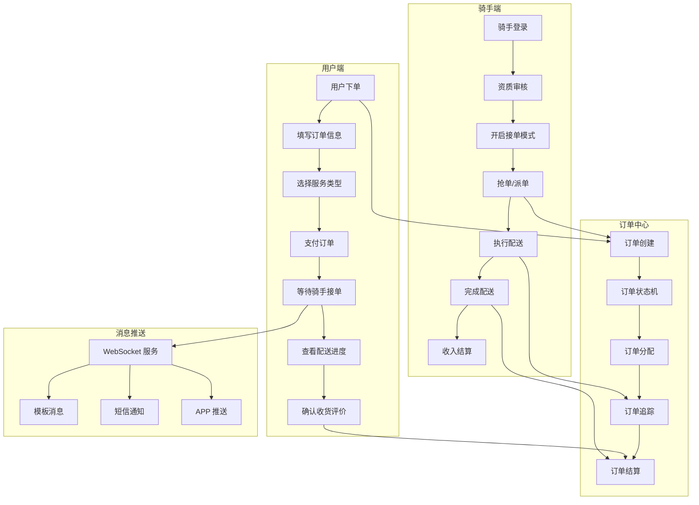
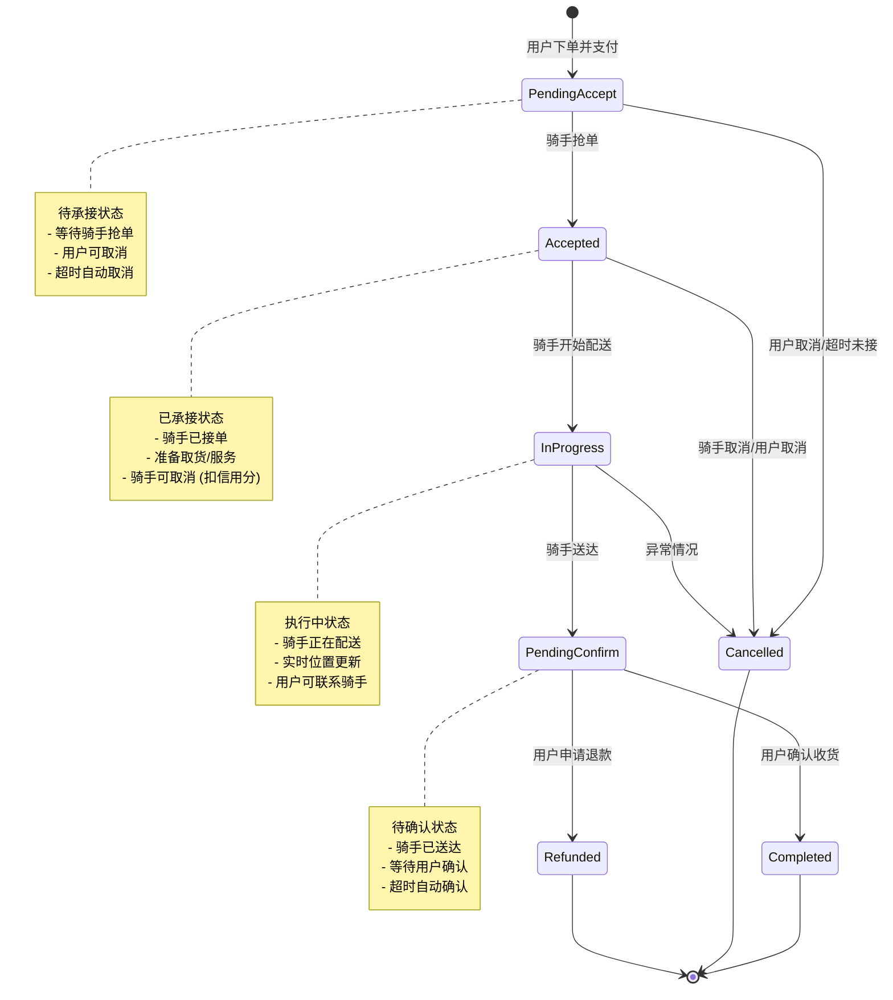
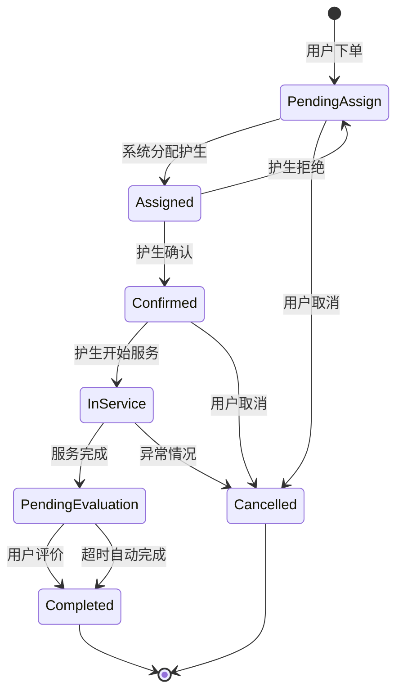

# delivery-mini-app 跑腿配送小程序学习笔记

## 1. 项目概览

### 基本信息
- **项目名称**: delivery-mini-app（跑腿配送小程序）
- **GitHub 地址**: https://github.com/NeoWeb3Nova/delivery-mini-app
- **项目类型**: 微信小程序 + 云开发
- **核心功能**: 同城跑腿配送、订单管理、骑手接单、实时追踪
- **技术栈**: 微信小程序、uni-app、Node.js、WebSocket

### 核心特性
1. **双端设计**: 用户端（下单）+ 骑手端（接单配送）
2. **实时状态流转**: 订单全生命周期管理
3. **智能分配**: 基于位置、评分、接单量的匹配算法
4. **消息推送**: 实时通知订单状态变化
5. **分布式锁**: 防止订单重复抢单

---

## 2. 业务架构图



### 系统模块说明

| 模块 | 职责 | 关键技术 |
|------|------|----------|
| 用户端 | 下单、支付、追踪、评价 | 微信小程序、uni-app |
| 骑手端 | 接单、配送、收入 | 微信小程序、地理位置 |
| 订单中心 | 状态管理、分配、结算 | 状态机、分布式锁 |
| 消息推送 | 实时通知 | WebSocket、模板消息 |
| 位置服务 | 距离计算、路径规划 | 腾讯地图 API |

---

## 3. 核心业务流程

### 3.1 用户下单流程

```javascript
// pages/order/create/create.js
Page({
  data: {
    orderInfo: {
      serviceType: '',      // 服务类型：代购、代取、代送
      pickupAddress: '',    // 取件地址
      deliveryAddress: '',  // 送达地址
      goodsDescription: '', // 物品描述
      expectedTime: '',     // 期望时间
      contactPhone: '',     // 联系电话
      remark: ''            // 备注
    },
    calculatedFee: 0        // 计算后的费用
  },

  // 计算配送费用
  calculateFee() {
    const { pickupAddress, deliveryAddress, serviceType } = this.data.orderInfo;
    
    // 调用地图 API 计算距离
    wx.request({
      url: 'https://apis.map.qq.com/ws/distance/v1',
      data: {
        from: pickupAddress,
        to: deliveryAddress,
        key: MAP_KEY
      },
      success: (res) => {
        const distance = res.data.result.elements[0].distance; // 米
        const baseFee = 5;          // 起步价
        const distanceFee = Math.ceil(distance / 1000) * 2; // 每公里 2 元
        const serviceFee = this.getServiceTypeFee(serviceType); // 服务类型加价
        
        this.setData({
          calculatedFee: baseFee + distanceFee + serviceFee
        });
      }
    });
  },

  // 提交订单
  submitOrder() {
    const { orderInfo, calculatedFee } = this.data;
    
    // 验证必填项
    if (!this.validateOrder(orderInfo)) {
      wx.showToast({ title: '请填写完整信息', icon: 'none' });
      return;
    }

    wx.showLoading({ title: '创建订单中' });
    
    // 调用云函数创建订单
    wx.cloud.callFunction({
      name: 'order',
      data: {
        action: 'create',
        orderData: {
          ...orderInfo,
          fee: calculatedFee,
          status: 'pending_accept',  // 待承接
          createTime: new Date().getTime(),
          userId: getApp().globalData.userInfo._id
        }
      },
      success: (res) => {
        wx.hideLoading();
        if (res.result.success) {
          // 跳转到支付页面
          wx.navigateTo({
            url: `/pages/order/pay/pay?orderId=${res.result.orderId}`
          });
        }
      }
    });
  }
});
```

### 3.2 骑手抢单流程（分布式锁）

```javascript
// cloudfunctions/order/index.js (云函数)
const cloud = require('wx-server-sdk');
cloud.init({ env: cloud.DYNAMIC_CURRENT_ENV });
const db = cloud.database();
const _ = db.command;

// 抢单核心逻辑 - 使用分布式锁防止重复抢单
exports.grabOrder = async (event) => {
  const { orderId, riderId } = event;
  const transaction = await db.startTransaction();
  
  try {
    // 1. 获取订单当前状态（加锁读取）
    const orderRes = await transaction.collection('orders').doc(orderId).get();
    const order = orderRes.data;
    
    // 2. 检查订单是否可抢
    if (order.status !== 'pending_accept') {
      return { success: false, message: '订单已被抢' };
    }
    
    // 3. 检查骑手资质
    const riderRes = await transaction.collection('riders').doc(riderId).get();
    const rider = riderRes.data;
    
    if (rider.status !== 'active') {
      return { success: false, message: '骑手账号异常' };
    }
    
    if (rider.currentOrderCount >= rider.maxOrderCount) {
      return { success: false, message: '已达接单上限' };
    }
    
    // 4. 原子性更新订单状态（关键：使用 set 操作确保原子性）
    const updateRes = await transaction.collection('orders').doc(orderId).update({
      data: {
        status: 'accepted',
        riderId: riderId,
        acceptTime: new Date().getTime(),
        updateTime: new Date().getTime()
      }
    });
    
    // 5. 更新骑手当前订单数
    await transaction.collection('riders').doc(riderId).update({
      data: {
        currentOrderCount: _.inc(1),
        totalOrders: _.inc(1)
      }
    });
    
    await transaction.commit();
    
    // 6. 推送消息给用户
    await sendOrderStatusNotification(order.userId, orderId, 'accepted', rider);
    
    return { success: true, message: '抢单成功' };
    
  } catch (err) {
    await transaction.rollback();
    console.error('抢单失败:', err);
    return { success: false, message: '系统繁忙，请稍后重试' };
  }
};

// 分布式锁实现（基于 Redis）
class DistributedLock {
  constructor(redisClient) {
    this.redis = redisClient;
  }
  
  // 获取锁
  async acquire(lockKey, ttl = 5000) {
    const lockValue = `${Date.now()}-${Math.random()}`;
    const result = await this.redis.set(lockKey, lockValue, 'PX', ttl, 'NX');
    return result === 'OK' ? lockValue : null;
  }
  
  // 释放锁
  async release(lockKey, lockValue) {
    const script = `
      if redis.call("get",KEYS[1]) == ARGV[1] then
        return redis.call("del",KEYS[1])
      else
        return 0
      end
    `;
    return await this.redis.eval(script, 1, lockKey, lockValue);
  }
}
```

### 3.3 订单状态流转

```javascript
// 订单状态机定义
const ORDER_STATUS = {
  PENDING_ACCEPT: 'pending_accept',    // 待承接
  ACCEPTED: 'accepted',                // 已承接/待执行
  IN_PROGRESS: 'in_progress',          // 执行中
  PENDING_CONFIRM: 'pending_confirm',  // 待确认
  COMPLETED: 'completed',              // 已完成
  CANCELLED: 'cancelled',              // 已取消
  REFUNDED: 'refunded'                 // 已退款
};

// 状态流转规则
const STATUS_TRANSITIONS = {
  [ORDER_STATUS.PENDING_ACCEPT]: [
    ORDER_STATUS.ACCEPTED,
    ORDER_STATUS.CANCELLED
  ],
  [ORDER_STATUS.ACCEPTED]: [
    ORDER_STATUS.IN_PROGRESS,
    ORDER_STATUS.CANCELLED
  ],
  [ORDER_STATUS.IN_PROGRESS]: [
    ORDER_STATUS.PENDING_CONFIRM,
    ORDER_STATUS.CANCELLED
  ],
  [ORDER_STATUS.PENDING_CONFIRM]: [
    ORDER_STATUS.COMPLETED,
    ORDER_STATUS.REFUNDED
  ],
  [ORDER_STATUS.COMPLETED]: [],
  [ORDER_STATUS.CANCELLED]: [],
  [ORDER_STATUS.REFUNDED]: []
};

// 状态变更函数
async function changeOrderStatus(orderId, newStatus, operatorId, operatorType) {
  const order = await db.collection('orders').doc(orderId).get();
  const currentStatus = order.status;
  
  // 1. 验证状态流转是否合法
  const allowedTransitions = STATUS_TRANSITIONS[currentStatus];
  if (!allowedTransitions.includes(newStatus)) {
    throw new Error(`不允许的状态流转：${currentStatus} -> ${newStatus}`);
  }
  
  // 2. 执行状态变更
  const updateData = {
    status: newStatus,
    updateTime: new Date().getTime(),
    statusHistory: _.push({
      from: currentStatus,
      to: newStatus,
      operatorId,
      operatorType,
      time: new Date().getTime()
    })
  };
  
  // 3. 根据新状态执行额外逻辑
  if (newStatus === ORDER_STATUS.COMPLETED) {
    updateData.completeTime = new Date().getTime();
    // 触发结算逻辑
    await settleOrder(orderId);
  }
  
  if (newStatus === ORDER_STATUS.IN_PROGRESS) {
    updateData.startTime = new Date().getTime();
  }
  
  await db.collection('orders').doc(orderId).update({
    data: updateData
  });
  
  // 4. 推送状态变更通知
  await sendOrderStatusNotification(order.userId, orderId, newStatus);
  
  return { success: true };
}
```

### 3.4 消息推送流程

```javascript
// 消息推送服务
class NotificationService {
  // 发送订单状态通知
  async sendOrderStatusNotification(userId, orderId, status, riderInfo = null) {
    const order = await db.collection('orders').doc(orderId).get();
    
    const statusTextMap = {
      'accepted': '骑手已接单',
      'in_progress': '骑手正在配送中',
      'pending_confirm': '骑手已送达，请确认',
      'completed': '订单已完成',
      'cancelled': '订单已取消'
    };
    
    // 1. 发送微信小程序模板消息
    await this.sendTemplateMessage(userId, {
      templateId: 'ORDER_STATUS_CHANGE',
      page: `/pages/order/detail/detail?orderId=${orderId}`,
      data: {
        thing1: { value: statusTextMap[status] },
        thing2: { value: order.pickupAddress },
        thing3: { value: order.deliveryAddress },
        time4: { value: this.formatTime(new Date()) }
      }
    });
    
    // 2. 通过 WebSocket 推送实时消息
    await this.sendWebSocketMessage(userId, {
      type: 'ORDER_STATUS_UPDATE',
      data: {
        orderId,
        status,
        riderInfo,
        time: new Date().getTime()
      }
    });
    
    // 3. 重要状态发送短信
    if (['accepted', 'pending_confirm'].includes(status)) {
      await this.sendSMS(order.contactPhone, {
        template: 'SMS_ORDER_STATUS',
        params: {
          orderId: orderId.substring(orderId.length - 6),
          status: statusTextMap[status]
        }
      });
    }
  }
  
  // WebSocket 推送
  async sendWebSocketMessage(userId, message) {
    const connections = global.wsConnections.get(userId);
    if (connections) {
      connections.forEach(conn => {
        conn.send(JSON.stringify(message));
      });
    }
  }
}
```

---

## 4. 订单状态机设计

### 状态机图



### 状态机实现代码

```javascript
// 订单状态机类
class OrderStateMachine {
  constructor(orderId) {
    this.orderId = orderId;
    this.order = null;
  }
  
  // 加载订单
  async load() {
    this.order = await db.collection('orders').doc(this.orderId).get();
    return this.order;
  }
  
  // 检查是否可以执行某个动作
  can(action) {
    const transitions = {
      'accept': ['pending_accept'],
      'start': ['accepted'],
      'arrive': ['in_progress'],
      'complete': ['pending_confirm'],
      'cancel': ['pending_accept', 'accepted', 'in_progress'],
      'refund': ['pending_confirm', 'completed']
    };
    
    return transitions[action]?.includes(this.order.status);
  }
  
  // 执行状态转换
  async transition(action, context = {}) {
    await this.load();
    
    if (!this.can(action)) {
      throw new Error(`当前状态不能执行 ${action} 操作`);
    }
    
    const statusMap = {
      'accept': 'accepted',
      'start': 'in_progress',
      'arrive': 'pending_confirm',
      'complete': 'completed',
      'cancel': 'cancelled',
      'refund': 'refunded'
    };
    
    const newStatus = statusMap[action];
    
    // 记录状态变更日志
    const statusLog = {
      orderId: this.orderId,
      fromStatus: this.order.status,
      toStatus: newStatus,
      action,
      operatorId: context.operatorId,
      operatorType: context.operatorType,
      remark: context.remark,
      createTime: new Date()
    };
    
    await db.collection('order_status_logs').add({ data: statusLog });
    
    // 更新订单状态
    await db.collection('orders').doc(this.orderId).update({
      data: {
        status: newStatus,
        updateTime: new Date(),
        [`statusTrace.${newStatus}`]: new Date()
      }
    });
    
    // 触发状态变更事件
    await this.emitStatusChange(newStatus, context);
    
    return { success: true, newStatus };
  }
  
  // 状态变更事件处理
  async emitStatusChange(newStatus, context) {
    const handlers = {
      'accepted': this.handleAccepted.bind(this),
      'in_progress': this.handleInProgress.bind(this),
      'pending_confirm': this.handlePendingConfirm.bind(this),
      'completed': this.handleCompleted.bind(this),
      'cancelled': this.handleCancelled.bind(this)
    };
    
    if (handlers[newStatus]) {
      await handlers[newStatus](context);
    }
  }
  
  // 各状态的事件处理
  async handleAccepted(context) {
    // 通知用户骑手已接单
    await notificationService.sendOrderStatusNotification(
      this.order.userId,
      this.orderId,
      'accepted',
      context.riderInfo
    );
  }
  
  async handleCompleted(context) {
    // 触发结算
    await settlementService.settleOrder(this.orderId);
  }
  
  async handleCancelled(context) {
    // 触发退款
    if (this.order.paidAmount > 0) {
      await refundService.refund(this.orderId, context.reason);
    }
  }
}
```

---

## 5. 可复用代码片段

### 5.1 订单创建云函数

```javascript
// cloudfunctions/order/create.js
const cloud = require('wx-server-sdk');
cloud.init();
const db = cloud.database();

exports.main = async (event, context) => {
  const { orderData } = event;
  const wxContext = cloud.getWXContext();
  
  try {
    // 生成订单号
    const orderId = `ORD${Date.now()}${Math.random().toString(36).substr(2, 6).toUpperCase()}`;
    
    // 订单数据
    const order = {
      _id: orderId,
      orderNo: orderId,
      userId: wxContext.OPENID,
      unionId: wxContext.UNIONID,
      
      // 订单信息
      serviceType: orderData.serviceType,
      pickupAddress: orderData.pickupAddress,
      pickupContact: orderData.pickupContact,
      pickupPhone: orderData.pickupPhone,
      deliveryAddress: orderData.deliveryAddress,
      deliveryContact: orderData.deliveryContact,
      deliveryPhone: orderData.deliveryPhone,
      goodsDescription: orderData.goodsDescription,
      goodsWeight: orderData.goodsWeight,
      remark: orderData.remark,
      
      // 费用信息
      fee: orderData.fee,
      paidAmount: 0,
      
      // 状态信息
      status: 'pending_accept',
      statusTrace: {
        created: new Date()
      },
      statusHistory: [],
      
      // 骑手信息
      riderId: null,
      acceptTime: null,
      startTime: null,
      completeTime: null,
      
      // 时间信息
      createTime: new Date(),
      updateTime: new Date(),
      expectedTime: orderData.expectedTime,
      
      // 位置信息
      pickupLocation: orderData.pickupLocation,  // {latitude, longitude}
      deliveryLocation: orderData.deliveryLocation,
      
      // 评价信息
      rating: null,
      ratingContent: null
    };
    
    // 创建订单
    await db.collection('orders').add({ data: order });
    
    // 创建支付记录
    await db.collection('payments').add({
      data: {
        orderId,
        userId: wxContext.OPENID,
        amount: orderData.fee,
        status: 'unpaid',
        createTime: new Date()
      }
    });
    
    return {
      success: true,
      orderId,
      message: '订单创建成功'
    };
    
  } catch (err) {
    console.error('创建订单失败:', err);
    return {
      success: false,
      message: '订单创建失败',
      error: err.message
    };
  }
};
```

### 5.2 骑手位置上报

```javascript
// 骑手端 - 位置上报
function reportLocation(orderId, location) {
  wx.cloud.callFunction({
    name: 'order',
    data: {
      action: 'updateLocation',
      orderId,
      location: {
        latitude: location.latitude,
        longitude: location.longitude,
        timestamp: Date.now()
      }
    }
  });
}

// 云函数 - 处理位置更新
exports.updateLocation = async (event) => {
  const { orderId, location, riderId } = event;
  
  // 更新订单位置
  await db.collection('orders').doc(orderId).update({
    data: {
      riderLocation: location,
      locationHistory: _.push({
        ...location,
        riderId
      })
    }
  });
  
  // 通过 WebSocket 推送给用户
  const order = await db.collection('orders').doc(orderId).get();
  await notificationService.sendLocationUpdate(order.userId, {
    orderId,
    location,
    riderId
  });
  
  return { success: true };
};
```

### 5.3 订单列表查询

```javascript
// 分页查询订单列表
async function getOrderList({
  userId,
  status,
  page = 1,
  pageSize = 10,
  sortBy = 'createTime',
  sortOrder = 'desc'
}) {
  const offset = (page - 1) * pageSize;
  
  let query = db.collection('orders').where({
    userId
  });
  
  if (status) {
    query = query.and({
      status
    });
  }
  
  // 排序
  query = query.orderBy(sortBy, sortOrder);
  
  // 分页
  query = query.skip(offset).limit(pageSize);
  
  const result = await query.get();
  
  // 获取总数
  const countResult = await db.collection('orders')
    .where({ userId, ...(status ? { status } : {}) })
    .count();
  
  return {
    list: result.data,
    total: countResult.total,
    page,
    pageSize,
    hasMore: offset + pageSize < countResult.total
  };
}
```

---

## 6. 清如项目复用建议

### 6.1 护生订单场景适配

清如护生订单系统与跑腿配送小程序有以下共同点：
- 都需要订单状态流转管理
- 都需要服务者（骑手/护生）分配机制
- 都需要实时状态通知
- 都需要评价反馈系统

### 6.2 可复用模块

| 模块 | 复用方式 | 适配要点 |
|------|----------|----------|
| 订单状态机 | 直接复用 | 增加护生特有状态（如：服务中、服务完成确认） |
| 消息推送 | 直接复用 | 调整模板消息内容 |
| 位置服务 | 部分复用 | 护生可能不需要实时位置追踪 |
| 评价系统 | 直接复用 | 调整评价维度（专业度、态度等） |
| 支付结算 | 直接复用 | 调整结算周期和规则 |

### 6.3 需要改造的部分

```javascript
// 护生订单特有状态
const NURSING_ORDER_STATUS = {
  PENDING_ASSIGN: 'pending_assign',      // 待分配护生
  ASSIGNED: 'assigned',                  // 已分配护生
  CONFIRMED: 'confirmed',                // 护生确认接单
  IN_SERVICE: 'in_service',              // 服务中
  PENDING_EVALUATION: 'pending_evaluation', // 待评价
  COMPLETED: 'completed',                // 已完成
  REFUNDED: 'refunded'                   // 已退款
};

// 护生资质审核（比骑手更严格）
async function verifyNurseQualification(nurseId) {
  const nurse = await db.collection('nurses').doc(nurseId).get();
  
  // 检查必要资质
  const requiredCerts = [
    'nurse_license',      // 护士执业证
    'health_certificate', // 健康证
    'background_check',   // 背景调查
    'training_certificate' // 培训证书
  ];
  
  const hasAllCerts = requiredCerts.every(cert => 
    nurse.certificates?.[cert]?.verified === true
  );
  
  if (!hasAllCerts) {
    return { verified: false, message: '资质不完整' };
  }
  
  // 检查资质有效期
  const now = new Date();
  for (const cert of requiredCerts) {
    const expireDate = new Date(nurse.certificates[cert].expireDate);
    if (expireDate < now) {
      return { verified: false, message: `${cert} 已过期` };
    }
  }
  
  return { verified: true };
}
```

### 6.4 护生订单状态机适配



### 6.5 实施建议

1. **第一阶段**: 复用订单状态机框架，定义护生特有状态
2. **第二阶段**: 改造资质审核模块，增加护生资质验证
3. **第三阶段**: 调整消息推送模板，适配护生场景
4. **第四阶段**: 优化分配算法，考虑护生专业方向、距离等
5. **第五阶段**: 完善评价系统，增加专业度评价维度

---

## 7. 总结

### 核心收获

1. **订单状态机设计**: 使用状态模式管理订单生命周期，确保状态流转的合法性和可追溯性
2. **分布式锁应用**: 在高并发抢单场景下，使用 Redis 分布式锁防止重复抢单
3. **实时消息推送**: 结合 WebSocket 和模板消息，实现多通道实时通知
4. **位置服务集成**: 利用地图 API 实现距离计算、路径规划和实时位置追踪
5. **云开发模式**: 使用微信小程序云开发，降低后端运维成本

### 技术亮点

- 原子性操作保证数据一致性
- 状态变更日志完整记录
- 多维度订单查询和筛选
- 灵活的支付结算体系
- 完善的评价反馈机制

### 可借鉴经验

1. 使用状态机模式管理复杂业务流程
2. 分布式锁解决并发竞争问题
3. 多通道消息推送提升用户体验
4. 详细的操作日志便于问题追溯
5. 模块化设计便于功能复用和扩展

---

**文档版本**: v1.0  
**创建时间**: 2026-04-04  
**学习来源**: https://github.com/NeoWeb3Nova/delivery-mini-app
