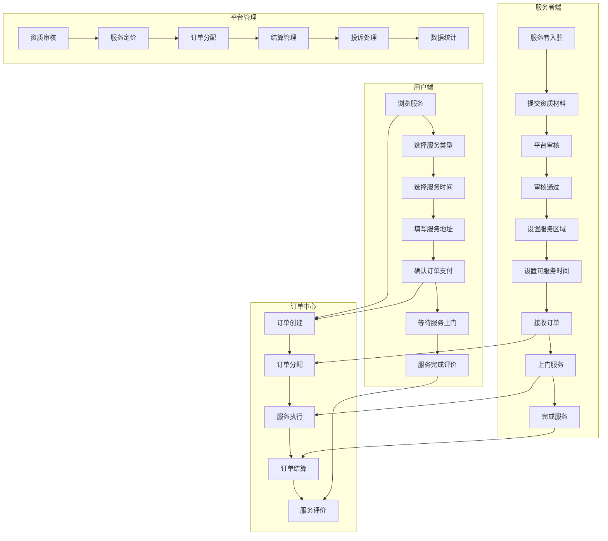
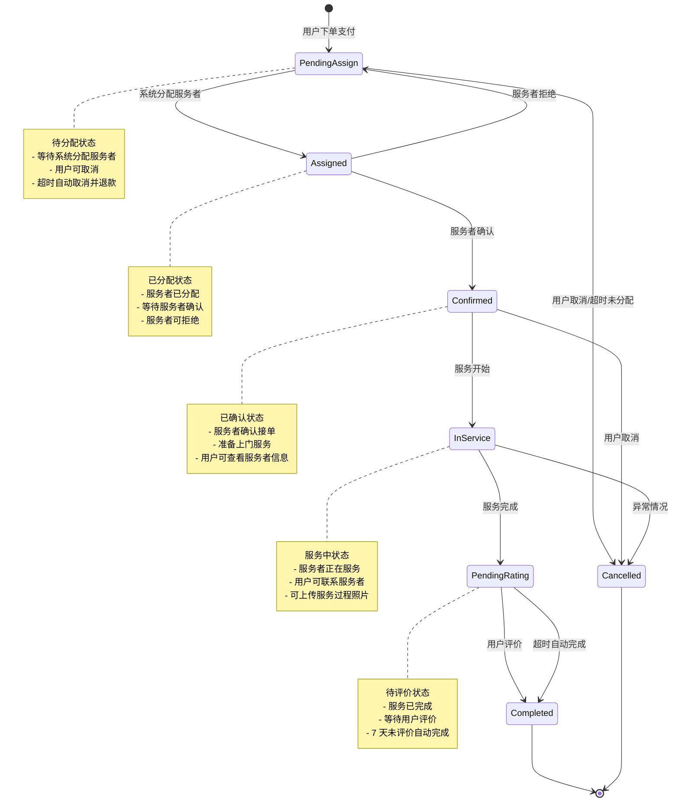
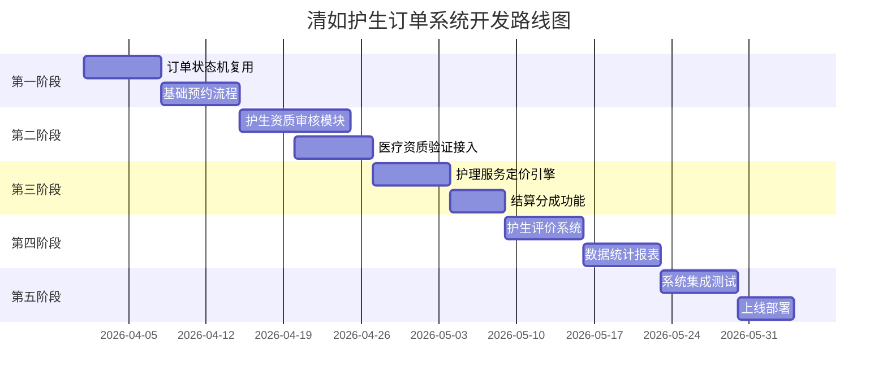

# home-service-miniprogram 家政预约小程序学习笔记

## 1. 项目概览

### 基本信息
- **项目名称**: home-service-miniprogram（家政预约小程序）
- **GitHub 地址**: https://github.com/20200324/home-service-miniprogram
- **项目类型**: 微信小程序 + 云开发
- **核心功能**: 家政服务预约、服务者管理、订单结算、评价系统
- **技术栈**: 微信小程序、uni-app、Node.js、云数据库

### 核心特性
1. **服务预约**: 用户在线预约家政服务（保洁、保姆、月嫂、护理等）
2. **服务者管理**: 服务者资质审核、排班管理、服务区域设置
3. **智能定价**: 基于服务类型、时长、难度的动态定价
4. **订单结算**: 平台服务费 + 服务者收入分成
5. **评价系统**: 多维度服务评价体系
6. **售后保障**: 退款、投诉、重新服务

### 与清如护生订单对比

| 维度 | 家政小程序 | 清如护生订单 | 相似度 |
|------|------------|--------------|--------|
| 服务类型 | 保洁、保姆、月嫂等 | 护生护理服务 | 高 |
| 服务者资质 | 健康证、技能证 | 护士证、执业证 | 高 |
| 预约模式 | 时间预约 + 上门服务 | 时间预约 + 上门服务 | 高 |
| 定价策略 | 按时长/服务类型 | 按护理等级/时长 | 中 |
| 结算方式 | 平台抽成 + 服务者收入 | 平台抽成 + 护生收入 | 高 |
| 评价维度 | 专业度、态度、准时 | 专业度、态度、效果 | 高 |

---

## 2. 业务架构图



### 系统模块说明

| 模块 | 职责 | 关键技术 |
|------|------|----------|
| 用户端 | 浏览服务、预约下单、支付评价 | 微信小程序 |
| 服务者端 | 入驻申请、接单服务、收入管理 | 微信小程序 |
| 资质审核 | 服务者资质审核、证书管理 | 人工 + 自动审核 |
| 订单管理 | 订单分配、状态跟踪、异常处理 | 状态机、智能分配 |
| 结算管理 | 服务费计算、分成结算、提现 | 支付 API、分账 |
| 评价系统 | 服务评价、信用评分、排行榜 | 评分算法 |

---

## 3. 核心业务流程

### 3.1 服务下单流程

```javascript
// pages/service/order/order.js
Page({
  data: {
    serviceTypes: [],           // 服务类型列表
    selectedService: null,      // 选中的服务
    selectedTime: null,         // 选中的服务时间
    address: null,              // 服务地址
    serviceDuration: 1,         // 服务时长（小时）
    calculatedPrice: 0,         // 计算价格
    couponList: [],             // 可用优惠券
    selectedCoupon: null        // 选中的优惠券
  },

  onLoad() {
    this.loadServiceTypes();
    this.loadAvailableTimeSlots();
    this.loadUserAddress();
    this.loadCoupons();
  },

  // 加载服务类型
  loadServiceTypes() {
    wx.cloud.callFunction({
      name: 'service',
      data: { action: 'getTypes' }
    }).then(res => {
      this.setData({ serviceTypes: res.result.data });
    });
  },

  // 选择服务类型
  selectService(service) {
    this.setData({ selectedService: service });
    this.calculatePrice();
  },

  // 选择服务时间
  selectTimeSlot(timeSlot) {
    // 检查时间是否可预约
    if (!timeSlot.available) {
      wx.showToast({ title: '该时段已约满', icon: 'none' });
      return;
    }
    
    this.setData({ selectedTime: timeSlot });
  },

  // 计算服务价格
  calculatePrice() {
    const { selectedService, serviceDuration, selectedCoupon } = this.data;
    
    if (!selectedService) return;
    
    // 基础价格 = 单价 × 时长
    let basePrice = selectedService.pricePerHour * serviceDuration;
    
    // 附加费用
    const extraFees = {
      // 夜间服务费（20:00-8:00）
      nightFee: this.isNightTime(this.data.selectedTime) ? basePrice * 0.2 : 0,
      // 节假日服务费
      holidayFee: this.isHoliday(this.data.selectedTime) ? basePrice * 0.3 : 0,
      // 特殊服务加价（如开荒保洁）
      specialFee: selectedService.specialFee || 0,
      // 远程服务费（超出服务区域）
      distanceFee: this.calculateDistanceFee()
    };
    
    const totalPrice = basePrice + extraFees.nightFee + extraFees.holidayFee + 
                       extraFees.specialFee + extraFees.distanceFee;
    
    // 优惠券折扣
    const discount = selectedCoupon ? selectedCoupon.amount : 0;
    
    this.setData({
      priceDetail: {
        basePrice,
        ...extraFees,
        discount,
        totalPrice: Math.max(0, totalPrice - discount)
      }
    });
  },

  // 提交订单
  submitOrder() {
    const { selectedService, selectedTime, address, priceDetail } = this.data;
    
    // 验证必填项
    if (!this.validateOrder()) {
      return;
    }
    
    wx.showLoading({ title: '创建订单中' });
    
    wx.cloud.callFunction({
      name: 'order',
      data: {
        action: 'create',
        orderData: {
          serviceId: selectedService._id,
          serviceName: selectedService.name,
          serviceType: selectedService.type,
          
          // 服务时间
          scheduledTime: selectedTime.start,
          duration: this.data.serviceDuration,
          
          // 服务地址
          address,
          location: address.location,
          
          // 价格信息
          priceDetail,
          totalAmount: priceDetail.totalPrice,
          
          // 订单状态
          status: 'pending_assign',
          createTime: new Date().getTime()
        }
      },
      success: (res) => {
        wx.hideLoading();
        if (res.result.success) {
          // 跳转到支付
          wx.navigateTo({
            url: `/pages/order/pay/pay?orderId=${res.result.orderId}`
          });
        }
      }
    });
  }
});
```

### 3.2 服务者资质审核流程

```javascript
// cloudfunctions/provider/verify.js
const cloud = require('wx-server-sdk');
cloud.init();
const db = cloud.database();

// 服务者资质审核
exports.verifyProvider = async (event, context) => {
  const { providerId, action, auditRemark, auditResult } = event;
  const adminId = context.ADMIN_USER_ID; // 管理员 ID
  
  try {
    const provider = await db.collection('providers').doc(providerId).get();
    
    if (!provider) {
      return { success: false, message: '服务者不存在' };
    }
    
    // 获取资质材料
    const certificates = provider.certificates || [];
    
    // 自动审核规则
    const autoAuditRules = {
      // 必须包含的证书
      requiredCerts: ['identity_card', 'health_certificate'],
      // 证书必须清晰（通过图片质量检测）
      minImageQuality: 0.7,
      // 实名认证必须通过
      requireRealName: true
    };
    
    // 执行自动审核
    const autoAuditResult = await performAutoAudit(provider, autoAuditRules);
    
    if (action === 'submit') {
      // 服务者提交审核
      if (!autoAuditResult.passed) {
        return {
          success: false,
          message: '资质材料不符合要求',
          reasons: autoAuditResult.reasons
        };
      }
      
      // 更新状态为待审核
      await db.collection('providers').doc(providerId).update({
        data: {
          auditStatus: 'pending',
          submitTime: new Date(),
          certificates: certificates
        }
      });
      
      // 通知管理员审核
      await notifyAdminForAudit(providerId);
      
      return { success: true, message: '提交成功，等待审核' };
      
    } else if (action === 'approve') {
      // 管理员审核通过
      await db.collection('providers').doc(providerId).update({
        data: {
          auditStatus: 'approved',
          auditTime: new Date(),
          auditorId: adminId,
          auditRemark,
          status: 'active'  // 激活服务者账号
        }
      });
      
      // 发送通过通知
      await sendAuditNotification(providerId, 'approved', auditRemark);
      
      return { success: true, message: '审核通过' };
      
    } else if (action === 'reject') {
      // 管理员审核拒绝
      await db.collection('providers').doc(providerId).update({
        data: {
          auditStatus: 'rejected',
          auditTime: new Date(),
          auditorId: adminId,
          auditRemark,
          status: 'inactive'
        }
      });
      
      // 发送拒绝通知
      await sendAuditNotification(providerId, 'rejected', auditRemark);
      
      return { success: true, message: '审核拒绝' };
    }
    
  } catch (err) {
    console.error('资质审核失败:', err);
    return { success: false, message: '审核失败', error: err.message };
  }
};

// 自动审核逻辑
async function performAutoAudit(provider, rules) {
  const reasons = [];
  
  // 检查必填证书
  for (const cert of rules.requiredCerts) {
    const hasCert = provider.certificates?.some(c => c.type === cert && c.verified);
    if (!hasCert) {
      reasons.push(`缺少${getCertName(cert)}证书`);
    }
  }
  
  // 检查实名认证
  if (rules.requireRealName && !provider.realNameVerified) {
    reasons.push('未完成实名认证');
  }
  
  // 检查证书图片质量（调用图片质量检测 API）
  for (const cert of provider.certificates || []) {
    if (cert.imageUrl) {
      const quality = await checkImageQuality(cert.imageUrl);
      if (quality < rules.minImageQuality) {
        reasons.push(`${getCertName(cert.type)}证书图片不清晰`);
      }
    }
  }
  
  // 检查年龄限制
  if (provider.age < 18 || provider.age > 60) {
    reasons.push('年龄不在服务范围内（18-60 岁）');
  }
  
  return {
    passed: reasons.length === 0,
    reasons
  };
}

// 证书类型映射
function getCertName(certType) {
  const certNames = {
    'identity_card': '身份证',
    'health_certificate': '健康证',
    'nurse_license': '护士执业证',
    'training_certificate': '培训证书',
    'skill_certificate': '技能证书'
  };
  return certNames[certType] || certType;
}
```

### 3.3 服务定价策略

```javascript
// 服务定价引擎
class PricingEngine {
  constructor() {
    this.basePrices = {};      // 基础价格表
    this.rules = {};           // 定价规则
  }
  
  // 计算服务价格
  calculatePrice(serviceConfig) {
    const {
      serviceType,
      duration,
      scheduledTime,
      address,
      providerLevel,
      specialRequirements
    } = serviceConfig;
    
    // 1. 基础价格
    const basePrice = this.getBasePrice(serviceType, duration);
    
    // 2. 时间系数
    const timeMultiplier = this.getTimeMultiplier(scheduledTime);
    
    // 3. 服务者等级系数
    const providerMultiplier = this.getProviderMultiplier(providerLevel);
    
    // 4. 距离系数
    const distanceMultiplier = this.getDistanceMultiplier(address);
    
    // 5. 特殊需求加价
    const specialFee = this.getSpecialRequirementFee(specialRequirements);
    
    // 6. 平台服务费
    const platformFeeRate = this.getPlatformFeeRate(serviceType);
    
    // 计算总价
    const servicePrice = basePrice * timeMultiplier * providerMultiplier * distanceMultiplier;
    const totalPrice = servicePrice + specialFee;
    const platformFee = totalPrice * platformFeeRate;
    const providerIncome = totalPrice - platformFee;
    
    return {
      basePrice,
      timeMultiplier,
      providerMultiplier,
      distanceMultiplier,
      specialFee,
      servicePrice,
      platformFee,
      platformFeeRate,
      providerIncome,
      totalPrice,
      breakdown: {
        items: [
          { name: '基础服务费', amount: basePrice },
          { name: '时间系数', amount: basePrice * (timeMultiplier - 1) },
          { name: '服务者等级', amount: basePrice * (providerMultiplier - 1) },
          { name: '距离费用', amount: basePrice * (distanceMultiplier - 1) },
          { name: '特殊需求', amount: specialFee }
        ],
        discount: 0,
        platformFee,
        total: totalPrice
      }
    };
  }
  
  // 获取基础价格
  getBasePrice(serviceType, duration) {
    const priceMap = {
      'daily_cleaning': 40,      // 日常保洁 40 元/小时
      'deep_cleaning': 60,       // 深度保洁 60 元/小时
      'move_cleaning': 80,       // 开荒保洁 80 元/小时
      'appliance_cleaning': 100, // 家电清洗 100 元/小时
      'nanny': 50,               // 保姆 50 元/小时
      'confinement': 200,        // 月嫂 200 元/小时
      'elderly_care': 45,        // 养老护理 45 元/小时
      'baby_care': 55            // 育儿嫂 55 元/小时
    };
    
    return (priceMap[serviceType] || 40) * duration;
  }
  
  // 时间系数（夜间、节假日加价）
  getTimeMultiplier(scheduledTime) {
    const date = new Date(scheduledTime);
    const hour = date.getHours();
    const dayOfWeek = date.getDay();
    
    let multiplier = 1.0;
    
    // 夜间服务（20:00-8:00）加价 20%
    if (hour >= 20 || hour < 8) {
      multiplier += 0.2;
    }
    
    // 周末加价 10%
    if (dayOfWeek === 0 || dayOfWeek === 6) {
      multiplier += 0.1;
    }
    
    // 法定节假日加价 30%
    if (this.isHoliday(date)) {
      multiplier += 0.3;
    }
    
    return multiplier;
  }
  
  // 服务者等级系数
  getProviderMultiplier(providerLevel) {
    const levelMap = {
      'junior': 1.0,     // 初级
      'intermediate': 1.2, // 中级
      'senior': 1.5,     // 高级
      'expert': 2.0      // 专家
    };
    
    return levelMap[providerLevel] || 1.0;
  }
  
  // 距离系数（超出服务区域）
  getDistanceMultiplier(address) {
    // 计算与服务者常驻区域的距离
    const distance = this.calculateDistance(address);
    
    if (distance <= 5) {
      return 1.0;  // 5km 内不加价
    } else if (distance <= 10) {
      return 1.1;  // 5-10km 加价 10%
    } else if (distance <= 20) {
      return 1.2;  // 10-20km 加价 20%
    } else {
      return 1.3;  // 20km 以上加价 30%
    }
  }
  
  // 特殊需求加价
  getSpecialRequirementFee(requirements) {
    let fee = 0;
    
    const specialFees = {
      'pet_home': 20,        // 有宠物
      'large_area': 50,      // 大面积（>150㎡）
      'special_equipment': 100, // 需要特殊设备
      'urgent_service': 30   // 加急服务
    };
    
    if (requirements) {
      for (const req of requirements) {
        fee += specialFees[req] || 0;
      }
    }
    
    return fee;
  }
  
  // 平台服务费率
  getPlatformFeeRate(serviceType) {
    const feeMap = {
      'daily_cleaning': 0.2,
      'deep_cleaning': 0.2,
      'move_cleaning': 0.15,
      'nanny': 0.15,
      'confinement': 0.1,
      'elderly_care': 0.15,
      'baby_care': 0.15
    };
    
    return feeMap[serviceType] || 0.2;
  }
  
  // 判断是否节假日
  isHoliday(date) {
    // 简化实现，实际应调用节假日 API
    const holidays = ['2026-01-01', '2026-02-10', '2026-04-04', '2026-05-01'];
    const dateStr = this.formatDate(date);
    return holidays.includes(dateStr);
  }
  
  formatDate(date) {
    return date.toISOString().split('T')[0];
  }
  
  calculateDistance(address) {
    // 调用地图 API 计算距离
    return 5; // 示例
  }
}
```

### 3.4 订单结算逻辑

```javascript
// 订单结算服务
class SettlementService {
  // 订单结算
  async settleOrder(orderId) {
    const order = await db.collection('orders').doc(orderId).get();
    
    if (order.status !== 'completed') {
      throw new Error('订单未完成，无法结算');
    }
    
    if (order.settled) {
      throw new Error('订单已结算');
    }
    
    // 1. 计算分成
    const settlement = this.calculateSettlement(order);
    
    // 2. 创建结算记录
    const settlementRecord = {
      orderId,
      providerId: order.providerId,
      userId: order.userId,
      
      // 金额信息
      totalAmount: order.totalAmount,
      platformFee: settlement.platformFee,
      providerIncome: settlement.providerIncome,
      
      // 结算状态
      status: 'pending',
      createTime: new Date()
    };
    
    const settlementId = await db.collection('settlements').add({
      data: settlementRecord
    });
    
    // 3. 更新订单状态
    await db.collection('orders').doc(orderId).update({
      data: {
        settled: true,
        settlementId,
        settlementTime: new Date()
      }
    });
    
    // 4. 更新服务者收入
    await db.collection('providers').doc(order.providerId).update({
      data: {
        totalIncome: _.inc(settlement.providerIncome),
        pendingIncome: _.inc(settlement.providerIncome),
        completedOrders: _.inc(1)
      }
    });
    
    // 5. 记录平台收入
    await db.collection('platform_income').add({
      data: {
        orderId,
        amount: settlement.platformFee,
        type: 'service_fee',
        createTime: new Date()
      }
    });
    
    return { settlementId, ...settlement };
  }
  
  // 计算分成
  calculateSettlement(order) {
    const totalAmount = order.totalAmount;
    
    // 平台服务费率
    const platformFeeRate = this.getPlatformFeeRate(order.serviceType);
    
    // 平台服务费
    const platformFee = totalAmount * platformFeeRate;
    
    // 服务者收入
    let providerIncome = totalAmount - platformFee;
    
    // 扣除优惠券（如有）
    if (order.couponAmount) {
      providerIncome -= order.couponAmount;
    }
    
    // 奖惩调整
    if (order.rewardAmount) {
      providerIncome += order.rewardAmount;
    }
    if (order.punishAmount) {
      providerIncome -= order.punishAmount;
    }
    
    // 确保服务者收入不为负
    providerIncome = Math.max(0, providerIncome);
    
    // 重新计算平台服务费
    const actualPlatformFee = totalAmount - providerIncome;
    
    return {
      platformFee: actualPlatformFee,
      platformFeeRate,
      providerIncome,
      breakdown: {
        totalAmount,
        platformFee: actualPlatformFee,
        providerIncome,
        couponDeduction: order.couponAmount || 0,
        reward: order.rewardAmount || 0,
        punishment: order.punishAmount || 0
      }
    };
  }
  
  // 服务者提现
  async withdraw(providerId, amount) {
    const provider = await db.collection('providers').doc(providerId).get();
    
    if (provider.pendingIncome < amount) {
      throw new Error('可提现金额不足');
    }
    
    if (amount < 10) {
      throw new Error('最低提现金额 10 元');
    }
    
    // 创建提现记录
    const withdrawId = await db.collection('withdraws').add({
      data: {
        providerId,
        amount,
        status: 'pending',
        createTime: new Date()
      }
    });
    
    // 扣减可提现金额
    await db.collection('providers').doc(providerId).update({
      data: {
        pendingIncome: _.inc(-amount),
        freezingIncome: _.inc(amount)
      }
    });
    
    // 调用支付接口打款
    const withdrawResult = await this.processWithdraw(provider, amount);
    
    if (withdrawResult.success) {
      await db.collection('withdraws').doc(withdrawId).update({
        data: {
          status: 'completed',
          completeTime: new Date()
        }
      });
      
      await db.collection('providers').doc(providerId).update({
        data: {
          freezingIncome: _.inc(-amount),
          totalWithdrawn: _.inc(amount)
        }
      });
    } else {
      // 提现失败，恢复金额
      await db.collection('providers').doc(providerId).update({
        data: {
          pendingIncome: _.inc(amount),
          freezingIncome: _.inc(-amount)
        }
      });
    }
    
    return withdrawResult;
  }
}
```

### 3.5 服务评价系统

```javascript
// 服务评价服务
class RatingService {
  // 提交评价
  async submitRating(orderId, ratingData) {
    const order = await db.collection('orders').doc(orderId).get();
    
    if (order.status !== 'completed') {
      throw new Error('订单未完成，无法评价');
    }
    
    if (order.rated) {
      throw new Error('订单已评价');
    }
    
    // 评价数据验证
    const {
      overallRating,    // 总体评分 1-5
      professionalRating, // 专业度 1-5
      attitudeRating,   // 服务态度 1-5
      punctualityRating, // 准时度 1-5
      content,          // 评价内容
      images,           // 评价图片
      isAnonymous       // 是否匿名
    } = ratingData;
    
    // 创建评价记录
    const rating = {
      orderId,
      userId: order.userId,
      providerId: order.providerId,
      serviceId: order.serviceId,
      
      // 评分
      overallRating,
      professionalRating,
      attitudeRating,
      punctualityRating,
      
      // 评价内容
      content,
      images,
      isAnonymous,
      
      // 评价时间
      createTime: new Date()
    };
    
    const ratingId = await db.collection('ratings').add({ data: rating });
    
    // 更新订单状态
    await db.collection('orders').doc(orderId).update({
      data: {
        rated: true,
        ratingId,
        userRating: overallRating
      }
    });
    
    // 更新服务者评分
    await this.updateProviderRating(order.providerId, rating);
    
    // 更新服务评分
    await this.updateServiceRating(order.serviceId, rating);
    
    // 评价奖励
    if (overallRating >= 5) {
      await this.giveRatingReward(order.userId);
    }
    
    return { ratingId, success: true };
  }
  
  // 更新服务者评分
  async updateProviderRating(providerId, newRating) {
    // 获取服务者所有评价
    const ratings = await db.collection('ratings')
      .where({ providerId })
      .get();
    
    if (ratings.data.length === 0) return;
    
    // 计算各项平均分
    const stats = this.calculateRatingStats(ratings.data);
    
    // 计算综合评分（加权平均）
    const overallScore = (
      stats.professionalAvg * 0.4 +
      stats.attitudeAvg * 0.35 +
      stats.punctualityAvg * 0.25
    );
    
    // 更新服务者信息
    await db.collection('providers').doc(providerId).update({
      data: {
        rating: {
          overall: overallScore,
          professional: stats.professionalAvg,
          attitude: stats.attitudeAvg,
          punctuality: stats.punctualityAvg,
          totalRatings: ratings.data.length,
          
          // 评分分布
          distribution: stats.distribution
        },
        
        // 更新等级（基于评分和订单数）
        level: this.calculateProviderLevel(overallScore, stats.totalRatings)
      }
    });
  }
  
  // 计算评分统计
  calculateRatingStats(ratings) {
    const total = ratings.length;
    
    const professionalSum = ratings.reduce((sum, r) => sum + r.professionalRating, 0);
    const attitudeSum = ratings.reduce((sum, r) => sum + r.attitudeRating, 0);
    const punctualitySum = ratings.reduce((sum, r) => sum + r.punctualityRating, 0);
    
    // 评分分布
    const distribution = {
      5: ratings.filter(r => r.overallRating === 5).length,
      4: ratings.filter(r => r.overallRating === 4).length,
      3: ratings.filter(r => r.overallRating === 3).length,
      2: ratings.filter(r => r.overallRating === 2).length,
      1: ratings.filter(r => r.overallRating === 1).length
    };
    
    return {
      professionalAvg: professionalSum / total,
      attitudeAvg: attitudeSum / total,
      punctualityAvg: punctualitySum / total,
      totalRatings: total,
      distribution
    };
  }
  
  // 计算服务者等级
  calculateProviderLevel(score, orderCount) {
    if (score >= 4.8 && orderCount >= 100) return 'expert';
    if (score >= 4.5 && orderCount >= 50) return 'senior';
    if (score >= 4.0 && orderCount >= 10) return 'intermediate';
    return 'junior';
  }
  
  // 评价奖励
  async giveRatingReward(userId) {
    // 赠送优惠券
    await db.collection('coupons').add({
      data: {
        userId,
        type: 'rating_reward',
        amount: 5,
        minAmount: 50,
        validDays: 30,
        status: 'unused',
        createTime: new Date()
      }
    });
  }
}
```

---

## 4. 订单状态机设计

### 状态机图



### 状态流转代码

```javascript
// 订单状态流转控制
class OrderStateMachine {
  constructor(orderId) {
    this.orderId = orderId;
    this.order = null;
  }
  
  async load() {
    this.order = await db.collection('orders').doc(this.orderId).get();
    return this.order;
  }
  
  // 分配服务者
  async assignProvider(providerId) {
    await this.load();
    
    if (this.order.status !== 'pending_assign') {
      throw new Error('订单状态不允许分配');
    }
    
    // 检查服务者是否可用
    const provider = await db.collection('providers').doc(providerId).get();
    if (provider.status !== 'active') {
      throw new Error('服务者不可用');
    }
    
    if (!this.isProviderAvailable(provider, this.order)) {
      throw new Error('服务者时间冲突');
    }
    
    await this.transition('assigned', {
      providerId,
      providerName: provider.name,
      providerPhone: provider.phone
    });
    
    // 通知服务者
    await notifyProvider(providerId, this.order);
    
    return { success: true };
  }
  
  // 服务者确认
  async confirm(providerId) {
    await this.load();
    
    if (this.order.status !== 'assigned') {
      throw new Error('订单状态不允许确认');
    }
    
    if (this.order.providerId !== providerId) {
      throw new Error('非当前服务者');
    }
    
    await this.transition('confirmed', {
      confirmedBy: providerId,
      confirmTime: new Date()
    });
    
    // 通知用户
    await notifyUser(this.order.userId, '服务者已确认', this.order);
    
    return { success: true };
  }
  
  // 开始服务
  async startService(providerId) {
    await this.load();
    
    if (this.order.status !== 'confirmed') {
      throw new Error('订单状态不允许开始服务');
    }
    
    // 验证服务者位置（可选）
    if (providerId) {
      await this.verifyProviderLocation(providerId, this.order.address);
    }
    
    await this.transition('in_service', {
      startedBy: providerId,
      startTime: new Date()
    });
    
    return { success: true };
  }
  
  // 完成服务
  async completeService(providerId, serviceData) {
    await this.load();
    
    if (this.order.status !== 'in_service') {
      throw new Error('订单状态不允许完成服务');
    }
    
    await this.transition('pending_rating', {
      completedBy: providerId,
      completeTime: new Date(),
      serviceData
    });
    
    // 通知用户评价
    await notifyUser(this.order.userId, '服务已完成，请评价', this.order);
    
    return { success: true };
  }
  
  // 状态流转核心方法
  async transition(newStatus, context = {}) {
    const statusLog = {
      orderId: this.orderId,
      fromStatus: this.order.status,
      toStatus: newStatus,
      ...context,
      createTime: new Date()
    };
    
    await db.collection('order_status_logs').add({ data: statusLog });
    
    await db.collection('orders').doc(this.orderId).update({
      data: {
        status: newStatus,
        updateTime: new Date(),
        [`statusTrace.${newStatus}`]: new Date()
      }
    });
    
    this.order.status = newStatus;
  }
}
```

---

## 5. 可复用代码片段

### 5.1 服务者智能分配

```javascript
// 服务者分配算法
class ProviderAssignment {
  // 为订单分配最合适的服务者
  async assignProvider(order) {
    const { serviceType, scheduledTime, address } = order;
    
    // 1. 筛选符合条件的服务者
    const candidates = await this.filterCandidates({
      serviceType,
      scheduledTime,
      address
    });
    
    if (candidates.length === 0) {
      throw new Error('暂无可用服务者');
    }
    
    // 2. 计算每个服务者的匹配度分数
    const scored = candidates.map(provider => ({
      provider,
      score: this.calculateMatchScore(provider, order)
    }));
    
    // 3. 按分数排序
    scored.sort((a, b) => b.score - a.score);
    
    // 4. 返回最佳匹配
    return scored[0].provider;
  }
  
  // 筛选候选服务者
  async filterCandidates(criteria) {
    const { serviceType, scheduledTime, address } = criteria;
    
    let query = db.collection('providers').where({
      status: 'active',
      auditStatus: 'approved',
      serviceTypes: serviceType
    });
    
    // 筛选可用时间
    const availableProviders = await this.filterByAvailability(query, scheduledTime);
    
    // 筛选服务区域
    const inAreaProviders = await this.filterByServiceArea(availableProviders, address);
    
    return inAreaProviders;
  }
  
  // 计算匹配度分数
  calculateMatchScore(provider, order) {
    let score = 0;
    
    // 评分权重（40%）
    const ratingScore = (provider.rating?.overall || 3) * 10;
    score += ratingScore * 0.4;
    
    // 距离权重（30%）
    const distance = this.calculateDistance(provider.location, order.address);
    const distanceScore = Math.max(0, 10 - distance);
    score += distanceScore * 0.3;
    
    // 接单量权重（20%）
    const orderCountScore = Math.min(10, provider.completedOrders / 10);
    score += orderCountScore * 0.2;
    
    // 响应速度权重（10%）
    const responseScore = provider.avgResponseTime ? 
      Math.max(0, 10 - provider.avgResponseTime / 60) : 5;
    score += responseScore * 0.1;
    
    return score;
  }
}
```

### 5.2 服务时间槽管理

```javascript
// 可服务时间槽管理
class TimeSlotManager {
  // 获取可预约时间槽
  async getAvailableSlots(serviceType, date, providerId) {
    const slots = this.generateTimeSlots(date);
    
    // 获取已预约的时间
    const bookedSlots = await this.getBookedSlots(serviceType, date, providerId);
    
    // 标记已约满的时间槽
    return slots.map(slot => ({
      ...slot,
      available: !bookedSlots.includes(slot.start),
      providers: this.getAvailableProviders(slot, serviceType)
    }));
  }
  
  // 生成时间槽（每 2 小时一个）
  generateTimeSlots(date) {
    const slots = [];
    const startHour = 8;   // 最早 8 点
    const endHour = 20;    // 最晚 20 点
    const slotDuration = 2; // 每槽 2 小时
    
    for (let hour = startHour; hour < endHour; hour += slotDuration) {
      slots.push({
        start: new Date(date.setHours(hour, 0, 0, 0)),
        end: new Date(date.setHours(hour + slotDuration, 0, 0, 0)),
        display: `${hour}:00 - ${hour + slotDuration}:00`
      });
    }
    
    return slots;
  }
  
  // 获取已预约时间
  async getBookedSlots(serviceType, date, providerId) {
    const startOfDay = new Date(date).setHours(0, 0, 0, 0);
    const endOfDay = new Date(date).setHours(23, 59, 59, 999);
    
    const orders = await db.collection('orders').where({
      serviceType,
      scheduledTime: _.gte(startOfDay).and(_.lte(endOfDay)),
      status: _.in(['assigned', 'confirmed', 'in_service']),
      ...(providerId ? { providerId } : {})
    }).get();
    
    return orders.map(order => order.scheduledTime);
  }
}
```

---

## 6. 清如项目复用建议

### 6.1 护生订单场景适配分析

家政小程序与清如护生订单系统高度相似，以下模块可直接复用：

| 模块 | 复用程度 | 适配要点 |
|------|----------|----------|
| 服务预约流程 | 直接复用 | 服务类型改为护理服务 |
| 资质审核 | 高度复用 | 增加护士执业证等医疗资质 |
| 定价策略 | 中度复用 | 调整定价因子（护理等级、患者状况） |
| 订单结算 | 直接复用 | 调整分成比例 |
| 评价系统 | 高度复用 | 增加专业护理评价维度 |
| 时间槽管理 | 直接复用 | 可复用排班逻辑 |

### 6.2 护生资质审核适配

```javascript
// 护生资质审核（扩展家政审核）
const NURSING_CERTIFICATES = [
  {
    type: 'identity_card',
    name: '身份证',
    required: true
  },
  {
    type: 'nurse_license',
    name: '护士执业证书',
    required: true,
    verifySource: '国家卫健委护士注册系统'
  },
  {
    type: 'nurse_qualification',
    name: '护士资格证书',
    required: true,
    verifySource: '国家卫健委'
  },
  {
    type: 'health_certificate',
    name: '健康证',
    required: true,
    validPeriod: 365 // 天
  },
  {
    type: 'training_certificate',
    name: '专业培训证书',
    required: false
  },
  {
    type: 'background_check',
    name: '无犯罪记录证明',
    required: true
  }
];

// 护生等级评定
function calculateNurseLevel(provider) {
  const { rating, completedOrders, certificates, workYears } = provider;
  
  let level = 'junior';
  let score = 0;
  
  // 评分（40%）
  score += (rating?.overall || 3) * 20;
  
  // 订单数（20%）
  score += Math.min(20, completedOrders / 5);
  
  // 工作年限（20%）
  score += Math.min(20, workYears * 4);
  
  // 资质完整度（20%）
  const certScore = (certificates?.filter(c => c.verified).length || 0) / 
                    NURSING_CERTIFICATES.length * 20;
  score += certScore;
  
  if (score >= 80 && workYears >= 5) level = 'expert';
  else if (score >= 65 && workYears >= 3) level = 'senior';
  else if (score >= 50 && workYears >= 1) level = 'intermediate';
  
  return { level, score };
}
```

### 6.3 护生服务定价适配

```javascript
// 护生服务定价（扩展家政定价）
class NursingPricingEngine extends PricingEngine {
  getBasePrice(serviceType, duration) {
    const nursingPriceMap = {
      'basic_care': 50,         // 基础护理 50 元/小时
      'specialized_care': 80,   // 专科护理 80 元/小时
      'rehabilitation': 100,    // 康复护理 100 元/小时
      'elderly_care': 60,       // 养老护理 60 元/小时
      'postpartum_care': 150,   // 产后护理 150 元/小时
      'infant_care': 120,       // 婴儿护理 120 元/小时
      'medical_accompaniment': 80 // 就医陪护 80 元/小时
    };
    
    return (nursingPriceMap[serviceType] || 50) * duration;
  }
  
  // 护理难度系数
  getCareDifficultyMultiplier(patientCondition) {
    const difficultyMap = {
      'self_care': 1.0,           // 自理
      'semi_self_care': 1.2,      // 半自理
      'non_self_care': 1.5,       // 不能自理
      'bedridden': 1.8,           // 卧床
      'critical': 2.0             // 重症
    };
    
    return difficultyMap[patientCondition] || 1.0;
  }
  
  // 夜间护理加价
  getNightCareMultiplier(serviceHours) {
    const nightHours = serviceHours.filter(h => h >= 22 || h < 6);
    
    if (nightHours.length === serviceHours.length) {
      return 2.0;  // 纯夜间护理双倍
    } else if (nightHours.length > 0) {
      return 1.5;  // 含夜间时段 1.5 倍
    }
    
    return 1.0;
  }
}
```

### 6.4 护生评价维度适配

```javascript
// 护生评价维度（扩展家政评价）
const NURSING_RATING_DIMENSIONS = [
  {
    key: 'professional_skill',
    name: '专业技能',
    weight: 0.3,
    description: '护理操作规范、专业技能熟练度'
  },
  {
    key: 'service_attitude',
    name: '服务态度',
    weight: 0.25,
    description: '耐心、细心、责任心'
  },
  {
    key: 'communication',
    name: '沟通能力',
    weight: 0.15,
    description: '与患者及家属的沟通效果'
  },
  {
    key: 'punctuality',
    name: '准时守信',
    weight: 0.15,
    description: '按时上门、遵守约定'
  },
  {
    key: 'hygiene',
    name: '个人卫生',
    weight: 0.15,
    description: '着装整洁、操作卫生'
  }
];

// 计算护生综合评分
function calculateNursingRating(ratings) {
  const total = ratings.length;
  if (total === 0) return { overall: 0, dimensions: {} };
  
  const dimensionScores = {};
  
  for (const dim of NURSING_RATING_DIMENSIONS) {
    const sum = ratings.reduce((acc, r) => acc + (r[dim.key] || 0), 0);
    dimensionScores[dim.key] = sum / total;
  }
  
  // 加权计算综合评分
  const overall = NURSING_RATING_DIMENSIONS.reduce((acc, dim) => {
    return acc + (dimensionScores[dim.key] || 0) * dim.weight;
  }, 0);
  
  return {
    overall,
    dimensions: dimensionScores,
    totalRatings: total
  };
}
```

### 6.5 实施路线图



---

## 7. 总结

### 核心收获

1. **服务预约模式**: 时间槽管理 + 服务者分配的预约模式适用于多种上门服务场景
2. **资质审核体系**: 多层级资质审核（自动 + 人工）确保服务者质量
3. **动态定价策略**: 基于多维度因子的动态定价引擎，灵活适配不同业务
4. **评价驱动质量**: 多维度评价体系 + 等级评定，形成正向循环
5. **结算分成功能**: 清晰的分成逻辑 + 提现管理，保障服务者权益

### 技术亮点

- 智能服务者分配算法
- 灵活的时间槽管理
- 多维度动态定价
- 完善的评价体系
- 透明的结算分成功能

### 清如项目借鉴点

1. **订单状态机**: 直接复用状态流转框架，适配护生特有状态
2. **资质审核**: 扩展证书类型，增加医疗资质验证
3. **定价引擎**: 增加护理难度、患者状况等定价因子
4. **评价系统**: 增加专业技能、沟通能力等护理评价维度
5. **时间管理**: 复用排班和时间槽管理逻辑

---

**文档版本**: v1.0  
**创建时间**: 2026-04-04  
**学习来源**: https://github.com/20200324/home-service-miniprogram
