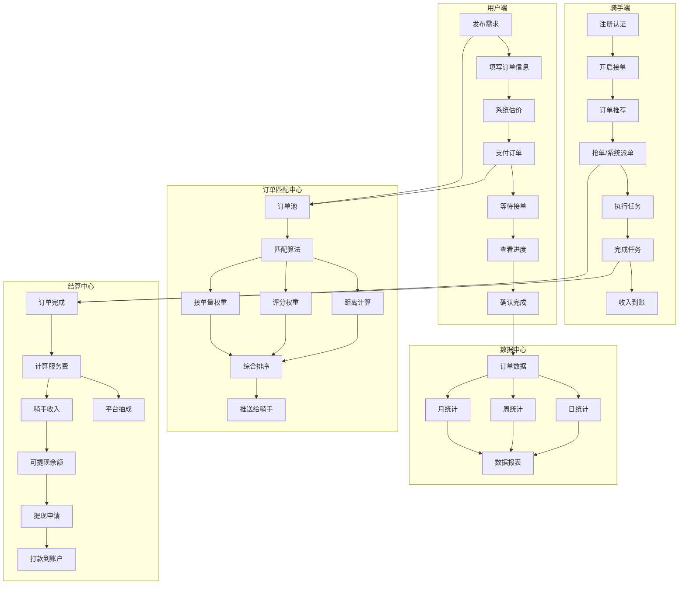
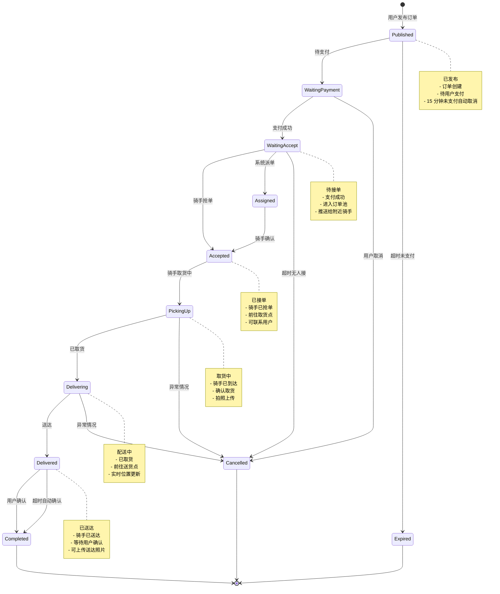
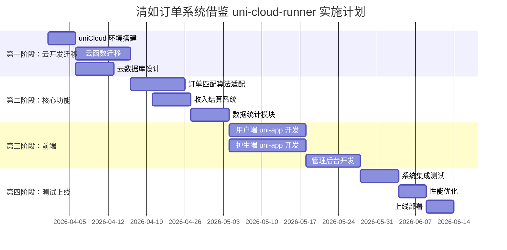

# uni-cloud-runner 跑腿接单全栈项目学习笔记

## 1. 项目概览

### 基本信息
- **项目名称**: uni-cloud-runner（跑腿接单全栈项目）
- **GitHub 地址**: https://github.com/uni-helper/uni-cloud-runner
- **项目类型**: uni-app + uniCloud 全栈项目
- **核心功能**: 跑腿订单匹配、智能派单、收入结算、数据统计
- **技术栈**: uni-app、uniCloud、云数据库、云函数、WebSocket

### 核心特性
1. **智能订单匹配**: 基于距离、评分、接单量的多维度匹配算法
2. **收入结算系统**: 平台服务费 + 服务者收入的清晰分成
3. **数据统计分析**: 日/周/月多维度数据统计
4. **uniCloud 云开发**: 免运维、弹性扩展、低成本
5. **实时消息推送**: 订单状态变更实时通知
6. **多端支持**: 小程序、APP、H5 多端统一

### 技术架构

```
┌─────────────────────────────────────────────────────────┐
│                      前端 (uni-app)                       │
│  ┌─────────────┐  ┌─────────────┐  ┌─────────────┐      │
│  │   用户端    │  │   骑手端    │  │   管理后台   │      │
│  │  小程序/APP │  │  小程序/APP │  │    H5       │      │
│  └─────────────┘  └─────────────┘  └─────────────┘      │
└─────────────────────────────────────────────────────────┘
                            │
                            ▼
┌─────────────────────────────────────────────────────────┐
│                    uniCloud 云开发                        │
│  ┌─────────────┐  ┌─────────────┐  ┌─────────────┐      │
│  │   云函数    │  │  云数据库   │  │  云存储     │      │
│  │  (业务逻辑) │  │  (数据存储) │  │  (文件存储) │      │
│  └─────────────┘  └─────────────┘  └─────────────┘      │
│  ┌─────────────┐  ┌─────────────┐  ┌─────────────┐      │
│  │  云调用     │  │  短信服务   │  │  推送服务   │      │
│  │  (第三方)   │  │             │  │             │      │
│  └─────────────┘  └─────────────┘  └─────────────┘      │
└─────────────────────────────────────────────────────────┘
```

---

## 2. 业务架构图



### 系统模块说明

| 模块 | 职责 | 关键技术 |
|------|------|----------|
| 用户端 | 发布需求、支付、追踪 | uni-app、微信支付 |
| 骑手端 | 抢单、执行、收入 | uni-app、地理位置 |
| 匹配中心 | 智能匹配、派单 | 匹配算法、Redis |
| 结算中心 | 费用计算、分成、提现 | 云函数、支付 API |
| 数据中心 | 统计分析、报表 | 聚合查询、图表 |
| 消息推送 | 实时通知 | WebSocket、推送 |

---

## 3. 核心业务流程

### 3.1 订单匹配算法

```javascript
// uniCloud-Cloud/cloudfunctions/order/match.js
const db = uniCloud.database();

/**
 * 订单匹配算法
 * 基于距离、评分、接单量的综合匹配
 */
exports.matchOrder = async (event) => {
  const { orderId } = event;
  
  // 1. 获取订单信息
  const order = await db.collection('orders').doc(orderId).get();
  if (!order) {
    throw new Error('订单不存在');
  }
  
  // 2. 获取附近骑手
  const nearbyRunners = await getNearbyRunners(
    order.pickup_location,
    order.delivery_location,
    5000 // 5 公里范围
  );
  
  if (nearbyRunners.length === 0) {
    return { success: false, message: '附近无可用骑手' };
  }
  
  // 3. 计算每个骑手的匹配分数
  const scoredRunners = await Promise.all(
    nearbyRunners.map(async (runner) => {
      const score = await calculateMatchScore(runner, order);
      return { runner, score };
    })
  );
  
  // 4. 按分数排序
  scoredRunners.sort((a, b) => b.score - a.score);
  
  // 5. 推送给前 N 个骑手（抢单模式）
  const topRunners = scoredRunners.slice(0, 10);
  await pushOrderToRunners(topRunners, order);
  
  // 6. 或者自动派单给最佳骑手（派单模式）
  // await autoAssignOrder(scoredRunners[0], order);
  
  return {
    success: true,
    matchedRunners: topRunners.map(r => r.runner),
    count: topRunners.length
  };
};

/**
 * 获取附近骑手
 */
async function getNearbyRunners(pickupLocation, deliveryLocation, radius = 5000) {
  // 使用地理位置查询
  const query = db.collection('runners');
  
  const runners = await query
    .where({
      status: 'online',           // 在线状态
      is_available: true,         // 可接单
      current_order_count: _.lt(3) // 当前订单数小于 3
    })
    .get();
  
  // 过滤距离
  const nearby = runners.data.filter(runner => {
    if (!runner.location) return false;
    
    // 计算到取货点的距离
    const pickupDistance = calculateDistance(
      runner.location,
      pickupLocation
    );
    
    // 计算到送货点的距离
    const deliveryDistance = calculateDistance(
      runner.location,
      deliveryLocation
    );
    
    // 在半径范围内
    return pickupDistance <= radius && deliveryDistance <= radius * 1.5;
  });
  
  return nearby;
}

/**
 * 计算匹配分数
 * 综合距离、评分、接单量等因素
 */
async function calculateMatchScore(runner, order) {
  const weights = {
    distance: 0.4,    // 距离权重 40%
    rating: 0.3,      // 评分权重 30%
    orderCount: 0.2,  // 接单量权重 20%
    responseTime: 0.1 // 响应速度权重 10%
  };
  
  // 1. 距离分数（0-100）
  const distance = calculateDistance(
    runner.location,
    order.pickup_location
  );
  const distanceScore = Math.max(0, 100 - distance / 50); // 每 50 米扣 1 分
  
  // 2. 评分分数（0-100）
  const ratingScore = (runner.rating?.overall || 3) * 20; // 5 分制转 100 分
  
  // 3. 接单量分数（0-100）
  const orderCountScore = Math.min(100, runner.completed_orders / 10); // 每 10 单加 1 分，上限 100
  
  // 4. 响应速度分数（0-100）
  const responseTimeScore = runner.avg_response_time ?
    Math.max(0, 100 - runner.avg_response_time / 10) : 50; // 平均响应时间（秒）
  
  // 5. 特殊因素加分
  let bonusScore = 0;
  
  // 熟悉路线加分
  if (isFamiliarRoute(runner, order.pickup_location, order.delivery_location)) {
    bonusScore += 10;
  }
  
  // 同类型订单经验加分
  if (hasSimilarOrderExperience(runner, order.type)) {
    bonusScore += 5;
  }
  
  // 6. 计算加权总分
  const totalScore = 
    distanceScore * weights.distance +
    ratingScore * weights.rating +
    orderCountScore * weights.orderCount +
    responseTimeScore * weights.responseTime +
    bonusScore;
  
  return {
    total: Math.round(totalScore),
    breakdown: {
      distance: Math.round(distanceScore),
      rating: Math.round(ratingScore),
      orderCount: Math.round(orderCountScore),
      responseTime: Math.round(responseTimeScore),
      bonus: bonusScore
    }
  };
}

/**
 * 计算两点间距离（Haversine 公式）
 */
function calculateDistance(from, to) {
  const R = 6371000; // 地球半径（米）
  
  const lat1 = from.latitude * Math.PI / 180;
  const lat2 = to.latitude * Math.PI / 180;
  const deltaLat = (to.latitude - from.latitude) * Math.PI / 180;
  const deltaLon = (to.longitude - from.longitude) * Math.PI / 180;
  
  const a = Math.sin(deltaLat / 2) ** 2 +
            Math.cos(lat1) * Math.cos(lat2) *
            Math.sin(deltaLon / 2) ** 2;
  
  const c = 2 * Math.atan2(Math.sqrt(a), Math.sqrt(1 - a));
  
  return R * c; // 米
}

/**
 * 判断是否是熟悉路线
 */
function isFamiliarRoute(runner, from, to) {
  // 检查骑手历史订单中是否有相似路线
  // 简化实现：检查骑手常驻区域
  if (!runner.frequent_areas) return false;
  
  return runner.frequent_areas.some(area => {
    return calculateDistance(area, from) < 2000 &&
           calculateDistance(area, to) < 2000;
  });
}

/**
 * 检查是否有同类型订单经验
 */
function hasSimilarOrderExperience(runner, orderType) {
  return runner.order_type_stats?.[orderType] > 10;
}
```

### 3.2 收入结算逻辑

```javascript
// uniCloud-Cloud/cloudfunctions/settlement/index.js
const db = uniCloud.database();

/**
 * 订单结算
 * 计算平台服务费和骑手收入
 */
exports.settleOrder = async (event) => {
  const { orderId } = event;
  
  const order = await db.collection('orders').doc(orderId).get();
  
  if (!order) {
    throw new Error('订单不存在');
  }
  
  if (order.status !== 'completed') {
    throw new Error('订单未完成，无法结算');
  }
  
  if (order.settled) {
    throw new Error('订单已结算');
  }
  
  // 1. 计算费用分成
  const settlement = calculateSettlement(order);
  
  // 2. 创建结算记录
  const settlementRecord = {
    order_id: orderId,
    runner_id: order.runner_id,
    user_id: order.user_id,
    
    // 金额明细
    total_amount: order.total_amount,
    platform_fee: settlement.platform_fee,
    runner_income: settlement.runner_income,
    base_fee: settlement.base_fee,
    distance_fee: settlement.distance_fee,
    tip: settlement.tip || 0,
    
    // 平台抽成明细
    platform_fee_rate: settlement.platform_fee_rate,
    platform_service: settlement.platform_service,
    insurance_fee: settlement.insurance_fee || 0,
    
    // 状态
    status: 'pending',
    create_time: new Date(),
    
    // 结算周期
    settlement_cycle: getSettlementCycle(),
    expected_pay_date: getExpectedPayDate()
  };
  
  const settlementId = await db.collection('settlements').add({
    data: settlementRecord
  });
  
  // 3. 更新订单状态
  await db.collection('orders').doc(orderId).update({
    data: {
      settled: true,
      settlement_id: settlementId,
      settlement_time: new Date()
    }
  });
  
  // 4. 更新骑手收入
  await db.collection('runners').doc(order.runner_id).update({
    data: {
      total_income: db.command.inc(settlement.runner_income),
      pending_income: db.command.inc(settlement.runner_income),
      completed_orders: db.command.inc(1),
      total_orders: db.command.inc(1)
    }
  });
  
  // 5. 记录平台收入
  await db.collection('platform_income').add({
    data: {
      order_id: orderId,
      amount: settlement.platform_fee,
      type: 'service_fee',
      breakdown: {
        service_fee: settlement.platform_service,
        insurance_fee: settlement.insurance_fee || 0
      },
      create_time: new Date()
    }
  });
  
  // 6. 发送结算通知
  await sendSettlementNotification(order.runner_id, {
    orderId,
    income: settlement.runner_income,
    settlementId
  });
  
  return {
    success: true,
    settlementId,
    runnerIncome: settlement.runner_income,
    platformFee: settlement.platform_fee
  };
};

/**
 * 计算费用分成
 */
function calculateSettlement(order) {
  const totalAmount = order.total_amount;
  
  // 基础费用分解
  const baseFee = order.price_detail?.base_fee || totalAmount * 0.7;
  const distanceFee = order.price_detail?.distance_fee || 0;
  const tip = order.tip || 0;
  
  // 平台服务费率（根据订单类型和骑手等级浮动）
  const platformFeeRate = getPlatformFeeRate(order, baseFee);
  
  // 平台服务费
  const platformService = baseFee * platformFeeRate;
  
  // 保险费（可选）
  const insuranceFee = order.insurance ? totalAmount * 0.01 : 0;
  
  // 平台总收费
  const platformFee = platformService + insuranceFee;
  
  // 骑手收入
  let runnerIncome = totalAmount - platformFee;
  
  // 小费全部给骑手
  runnerIncome += tip;
  
  // 确保骑手收入不为负
  runnerIncome = Math.max(0, runnerIncome);
  
  // 重新计算平台实际收费
  const actualPlatformFee = totalAmount - runnerIncome;
  
  return {
    platform_fee: actualPlatformFee,
    platform_fee_rate: platformFeeRate,
    runner_income: runnerIncome,
    base_fee: baseFee,
    distance_fee: distanceFee,
    tip: tip,
    platform_service: platformService,
    insurance_fee: insuranceFee,
    breakdown: {
      total: totalAmount,
      platform: {
        service_fee: platformService,
        insurance_fee: insuranceFee,
        total: actualPlatformFee
      },
      runner: {
        base_income: baseFee - platformService,
        distance_income: distanceFee,
        tip: tip,
        total: runnerIncome
      }
    }
  };
}

/**
 * 获取平台服务费率
 * 根据订单类型和骑手等级浮动
 */
function getPlatformFeeRate(order, baseFee) {
  // 基础费率
  let baseRate = 0.2; // 20%
  
  // 订单类型调整
  const typeRates = {
    'document': 0.15,      // 文件配送 15%
    'food': 0.2,           // 餐饮配送 20%
    'parcel': 0.18,        // 包裹配送 18%
    'shopping': 0.22,      // 代购服务 22%
    'queue': 0.25,         // 排队服务 25%
    'express': 0.3         // 加急订单 30%
  };
  
  if (typeRates[order.type]) {
    baseRate = typeRates[order.type];
  }
  
  // 骑手等级优惠（高等级骑手费率更低）
  const levelDiscounts = {
    'bronze': 0,      // 青铜无优惠
    'silver': 0.02,   // 白银优惠 2%
    'gold': 0.04,     // 黄金优惠 4%
    'platinum': 0.06, // 铂金优惠 6%
    'diamond': 0.08   // 钻石优惠 8%
  };
  
  const runnerLevel = order.runner_level || 'bronze';
  const discount = levelDiscounts[runnerLevel] || 0;
  
  // 最终费率（最低 10%）
  const finalRate = Math.max(0.1, baseRate - discount);
  
  return finalRate;
}

/**
 * 获取结算周期
 */
function getSettlementCycle() {
  const now = new Date();
  const day = now.getDate();
  
  // 每月 1 号和 15 号结算
  if (day <= 15) {
    return {
      start: new Date(now.getFullYear(), now.getMonth() - 1, 16),
      end: new Date(now.getFullYear(), now.getMonth(), 15)
    };
  } else {
    return {
      start: new Date(now.getFullYear(), now.getMonth(), 1),
      end: new Date(now.getFullYear(), now.getMonth(), 15)
    };
  }
}

/**
 * 获取预计打款日期
 */
function getExpectedPayDate() {
  const now = new Date();
  const day = now.getDate();
  
  // 每月 16 号和次月 1 号打款
  if (day <= 15) {
    return new Date(now.getFullYear(), now.getMonth(), 16);
  } else {
    return new Date(now.getFullYear(), now.getMonth() + 1, 1);
  }
}

/**
 * 骑手提现
 */
exports.withdraw = async (event, context) => {
  const { amount } = event;
  const runnerId = context.auth.uid; // 从认证信息获取骑手 ID
  
  if (amount < 10) {
    throw new Error('最低提现金额 10 元');
  }
  
  if (amount > 10000) {
    throw new Error('单笔提现上限 10000 元');
  }
  
  // 1. 获取骑手信息
  const runner = await db.collection('runners').doc(runnerId).get();
  
  if (runner.pending_income < amount) {
    throw new Error('可提现金额不足');
  }
  
  // 2. 创建提现记录
  const withdrawRecord = {
    runner_id: runnerId,
    amount,
    status: 'processing',
    withdraw_type: 'wechat', // 微信提现
    create_time: new Date()
  };
  
  const withdrawId = await db.collection('withdraws').add({
    data: withdrawRecord
  });
  
  // 3. 冻结金额
  await db.collection('runners').doc(runnerId).update({
    data: {
      pending_income: db.command.inc(-amount),
      freezing_income: db.command.inc(amount)
    }
  });
  
  // 4. 调用微信企业付款
  try {
    const paymentResult = await uniCloud.pay.weixin.withdraw({
      amount: amount * 100, // 分
      desc: '骑手提现',
      openid: runner.wechat_openid
    });
    
    if (paymentResult.result_code === 'SUCCESS') {
      // 5. 更新提现记录
      await db.collection('withdraws').doc(withdrawId).update({
        data: {
          status: 'completed',
          complete_time: new Date(),
          transaction_id: paymentResult.payment_no
        }
      });
      
      // 6. 更新骑手账户
      await db.collection('runners').doc(runnerId).update({
        data: {
          freezing_income: db.command.inc(-amount),
          total_withdrawn: db.command.inc(amount)
        }
      });
      
      return {
        success: true,
        withdrawId,
        message: '提现成功'
      };
    } else {
      throw new Error('微信打款失败');
    }
  } catch (err) {
    // 提现失败，恢复金额
    await db.collection('runners').doc(runnerId).update({
      data: {
        pending_income: db.command.inc(amount),
        freezing_income: db.command.inc(-amount)
      }
    });
    
    await db.collection('withdraws').doc(withdrawId).update({
      data: {
        status: 'failed',
        fail_reason: err.message
      }
    });
    
    throw err;
  }
};
```

### 3.3 数据统计维度

```javascript
// uniCloud-Cloud/cloudfunctions/statistics/index.js
const db = uniCloud.database();

/**
 * 数据统计服务
 * 提供日/周/月多维度统计
 */

// 获取骑手统计数据
exports.getRunnerStats = async (event, context) => {
  const { runnerId, timeRange = 'day' } = event;
  
  const timeFilter = getTimeRangeFilter(timeRange);
  
  // 1. 订单统计
  const orderStats = await getOrderStats(runnerId, timeFilter);
  
  // 2. 收入统计
  const incomeStats = await getIncomeStats(runnerId, timeFilter);
  
  // 3. 评价统计
  const ratingStats = await getRatingStats(runnerId, timeFilter);
  
  // 4. 效率统计
  const efficiencyStats = await getEfficiencyStats(runnerId, timeFilter);
  
  return {
    runnerId,
    timeRange,
    period: timeFilter.label,
    orders: orderStats,
    income: incomeStats,
    rating: ratingStats,
    efficiency: efficiencyStats
  };
};

/**
 * 订单统计
 */
async function getOrderStats(runnerId, timeFilter) {
  const ordersCollection = db.collection('orders');
  
  // 总订单数
  const totalRes = await ordersCollection
    .where({
      runner_id: runnerId,
      status: 'completed',
      complete_time: timeFilter.range
    })
    .count();
  
  // 按类型统计
  const typeRes = await ordersCollection
    .where({
      runner_id: runnerId,
      status: 'completed',
      complete_time: timeFilter.range
    })
    .groupBy('type')
    .count();
  
  // 按状态统计
  const statusRes = await ordersCollection
    .where({
      runner_id: runnerId,
      create_time: timeFilter.range
    })
    .groupBy('status')
    .count();
  
  // 取消订单数及原因
  const cancelledRes = await ordersCollection
    .where({
      runner_id: runnerId,
      status: 'cancelled',
      complete_time: timeFilter.range
    })
    .groupBy('cancel_reason')
    .count();
  
  return {
    total: totalRes.total,
    byType: typeRes.data,
    byStatus: statusRes.data,
    cancelled: {
      total: cancelledRes.total,
      byReason: cancelledRes.data
    },
    completionRate: totalRes.total > 0 ?
      ((totalRes.total - cancelledRes.total) / totalRes.total * 100).toFixed(2) + '%' : '0%'
  };
}

/**
 * 收入统计
 */
async function getIncomeStats(runnerId, timeFilter) {
  const settlementsCollection = db.collection('settlements');
  
  // 总收入
  const totalRes = await settlementsCollection
    .where({
      runner_id: runnerId,
      status: 'completed',
      create_time: timeFilter.range
    })
    .field({
      runner_income: true,
      tip: true
    })
    .get();
  
  const totalIncome = totalRes.data.reduce((sum, item) => sum + (item.runner_income || 0), 0);
  const totalTips = totalRes.data.reduce((sum, item) => sum + (item.tip || 0), 0);
  
  // 日均收入
  const days = getDaysInPeriod(timeFilter.range);
  const dailyAverage = days > 0 ? (totalIncome / days).toFixed(2) : 0;
  
  // 按订单类型统计收入
  const incomeByType = await settlementsCollection
    .where({
      runner_id: runnerId,
      status: 'completed',
      create_time: timeFilter.range
    })
    .groupBy('order_type')
    .sum('runner_income');
  
  // 收入趋势（按天）
  const incomeTrend = await getIncomeTrend(runnerId, timeFilter.range);
  
  return {
    total: totalIncome.toFixed(2),
    tips: totalTips.toFixed(2),
    dailyAverage,
    byType: incomeByType.data,
    trend: incomeTrend,
    orders: totalRes.data.length
  };
}

/**
 * 评价统计
 */
async function getRatingStats(runnerId, timeFilter) {
  const ratingsCollection = db.collection('ratings');
  
  // 获取所有评价
  const ratingsRes = await ratingsCollection
    .where({
      runner_id: runnerId,
      create_time: timeFilter.range
    })
    .get();
  
  const ratings = ratingsRes.data;
  
  if (ratings.length === 0) {
    return {
      total: 0,
      average: 0,
      distribution: {},
      dimensions: {}
    };
  }
  
  // 计算各项平均分
  const dimensions = ['overall', 'service', 'speed', 'attitude'];
  const dimensionScores = {};
  
  dimensions.forEach(dim => {
    const sum = ratings.reduce((acc, r) => acc + (r[`${dim}_rating`] || 0), 0);
    dimensionScores[dim] = (sum / ratings.length).toFixed(2);
  });
  
  // 评分分布
  const distribution = {
    5: ratings.filter(r => r.overall_rating === 5).length,
    4: ratings.filter(r => r.overall_rating === 4).length,
    3: ratings.filter(r => r.overall_rating === 3).length,
    2: ratings.filter(r => r.overall_rating === 2).length,
    1: ratings.filter(r => r.overall_rating === 1).length
  };
  
  // 好评率（4-5 星）
  const positiveRate = ((distribution[5] + distribution[4]) / ratings.length * 100).toFixed(2) + '%';
  
  return {
    total: ratings.length,
    average: dimensionScores.overall,
    distribution,
    dimensions: dimensionScores,
    positiveRate
  };
}

/**
 * 效率统计
 */
async function getEfficiencyStats(runnerId, timeFilter) {
  const ordersCollection = db.collection('orders');
  
  // 获取完成的订单
  const ordersRes = await ordersCollection
    .where({
      runner_id: runnerId,
      status: 'completed',
      complete_time: timeFilter.range
    })
    .field({
      accept_time: true,
      start_time: true,
      complete_time: true,
      scheduled_time: true
    })
    .get();
  
  const orders = ordersRes.data;
  
  if (orders.length === 0) {
    return {
      avgResponseTime: 0,
      avgServiceTime: 0,
      onTimeRate: '0%'
    };
  }
  
  // 平均响应时间（从发单到接单）
  const responseTimes = orders
    .filter(o => o.accept_time && o.create_time)
    .map(o => (o.accept_time - o.create_time) / 1000 / 60); // 分钟
  
  const avgResponseTime = responseTimes.length > 0 ?
    (responseTimes.reduce((a, b) => a + b, 0) / responseTimes.length).toFixed(2) : 0;
  
  // 平均服务时长（从接单到完成）
  const serviceTimes = orders
    .filter(o => o.complete_time && o.accept_time)
    .map(o => (o.complete_time - o.accept_time) / 1000 / 60); // 分钟
  
  const avgServiceTime = serviceTimes.length > 0 ?
    (serviceTimes.reduce((a, b) => a + b, 0) / serviceTimes.length).toFixed(2) : 0;
  
  // 准时率
  const onTimeOrders = orders.filter(o => {
    if (!o.scheduled_time || !o.complete_time) return true;
    return o.complete_time <= o.scheduled_time + 30 * 60 * 1000; // 允许 30 分钟误差
  }).length;
  
  const onTimeRate = (onTimeOrders / orders.length * 100).toFixed(2) + '%';
  
  return {
    avgResponseTime: `${avgResponseTime}分钟`,
    avgServiceTime: `${avgServiceTime}分钟`,
    onTimeRate,
    totalOrders: orders.length
  };
}

/**
 * 获取时间范围过滤器
 */
function getTimeRangeFilter(timeRange) {
  const now = new Date();
  let start, end, label;
  
  switch (timeRange) {
    case 'today':
      start = new Date(now.setHours(0, 0, 0, 0));
      end = new Date(now.setHours(23, 59, 59, 999));
      label = '今日';
      break;
      
    case 'yesterday':
      start = new Date(now.setDate(now.getDate() - 1));
      start.setHours(0, 0, 0, 0);
      end = new Date(now.setHours(23, 59, 59, 999));
      label = '昨日';
      break;
      
    case 'week':
      const dayOfWeek = now.getDay();
      const diff = now.getDate() - dayOfWeek + (dayOfWeek === 0 ? -6 : 1);
      start = new Date(now.setDate(diff));
      start.setHours(0, 0, 0, 0);
      end = new Date();
      end.setHours(23, 59, 59, 999);
      label = '本周';
      break;
      
    case 'month':
      start = new Date(now.getFullYear(), now.getMonth(), 1);
      end = new Date();
      end.setHours(23, 59, 59, 999);
      label = '本月';
      break;
      
    default:
      start = new Date(now.setHours(0, 0, 0, 0));
      end = new Date(now.setHours(23, 59, 59, 999));
      label = '今日';
  }
  
  return {
    range: db.command.gte(start).and(db.command.lte(end)),
    start,
    end,
    label
  };
}

/**
 * 获取收入趋势数据
 */
async function getIncomeTrend(runnerId, timeRange) {
  // 按天聚合收入数据
  const trend = await db.collection('settlements')
    .where({
      runner_id: runnerId,
      status: 'completed',
      create_time: timeRange
    })
    .groupBy(db.command.dateToString('$create_time', '%Y-%m-%d'))
    .sum('runner_income');
  
  return trend.data;
}

/**
 * 计算周期天数
 */
function getDaysInPeriod(range) {
  // 简化实现
  return 30;
}
```

---

## 4. 订单状态机设计

### 状态机图



### 状态机实现

```javascript
// uniCloud-Cloud/cloudfunctions/order/state-machine.js
const db = uniCloud.database();

// 订单状态定义
const ORDER_STATUS = {
  PUBLISHED: 'published',          // 已发布
  WAITING_PAYMENT: 'waiting_payment', // 待支付
  WAITING_ACCEPT: 'waiting_accept',   // 待接单
  ACCEPTED: 'accepted',              // 已接单
  PICKING_UP: 'picking_up',          // 取货中
  DELIVERING: 'delivering',          // 配送中
  DELIVERED: 'delivered',            // 已送达
  COMPLETED: 'completed',            // 已完成
  CANCELLED: 'cancelled',            // 已取消
  EXPIRED: 'expired'                 // 已过期
};

// 状态流转规则
const STATUS_TRANSITIONS = {
  [ORDER_STATUS.PUBLISHED]: [
    ORDER_STATUS.WAITING_PAYMENT,
    ORDER_STATUS.EXPIRED
  ],
  [ORDER_STATUS.WAITING_PAYMENT]: [
    ORDER_STATUS.WAITING_ACCEPT,
    ORDER_STATUS.CANCELLED
  ],
  [ORDER_STATUS.WAITING_ACCEPT]: [
    ORDER_STATUS.ACCEPTED,
    ORDER_STATUS.ASSIGNED,
    ORDER_STATUS.CANCELLED
  ],
  [ORDER_STATUS.ACCEPTED]: [
    ORDER_STATUS.PICKING_UP,
    ORDER_STATUS.CANCELLED
  ],
  [ORDER_STATUS.PICKING_UP]: [
    ORDER_STATUS.DELIVERING,
    ORDER_STATUS.CANCELLED
  ],
  [ORDER_STATUS.DELIVERING]: [
    ORDER_STATUS.DELIVERED,
    ORDER_STATUS.CANCELLED
  ],
  [ORDER_STATUS.DELIVERED]: [
    ORDER_STATUS.COMPLETED
  ],
  [ORDER_STATUS.COMPLETED]: [],
  [ORDER_STATUS.CANCELLED]: [],
  [ORDER_STATUS.EXPIRED]: []
};

class OrderStateMachine {
  constructor(orderId) {
    this.orderId = orderId;
    this.order = null;
  }
  
  // 加载订单
  async load() {
    const res = await db.collection('orders').doc(this.orderId).get();
    this.order = res.data;
    return this.order;
  }
  
  // 检查是否可以执行某个动作
  can(action) {
    const actionMap = {
      'pay': [ORDER_STATUS.WAITING_PAYMENT],
      'accept': [ORDER_STATUS.WAITING_ACCEPT],
      'assign': [ORDER_STATUS.WAITING_ACCEPT],
      'start_pickup': [ORDER_STATUS.ACCEPTED],
      'confirm_pickup': [ORDER_STATUS.PICKING_UP],
      'start_delivery': [ORDER_STATUS.PICKING_UP],
      'confirm_delivery': [ORDER_STATUS.DELIVERING],
      'confirm_receive': [ORDER_STATUS.DELIVERED],
      'cancel': [ORDER_STATUS.PUBLISHED, ORDER_STATUS.WAITING_PAYMENT, 
                 ORDER_STATUS.WAITING_ACCEPT, ORDER_STATUS.ACCEPTED, 
                 ORDER_STATUS.PICKING_UP, ORDER_STATUS.DELIVERING]
    };
    
    return actionMap[action]?.includes(this.order.status);
  }
  
  // 执行状态转换
  async transition(action, context = {}) {
    await this.load();
    
    if (!this.can(action)) {
      throw new Error(`当前状态不能执行 ${action} 操作`);
    }
    
    const statusMap = {
      'pay': ORDER_STATUS.WAITING_ACCEPT,
      'accept': ORDER_STATUS.ACCEPTED,
      'assign': ORDER_STATUS.ASSIGNED,
      'start_pickup': ORDER_STATUS.PICKING_UP,
      'confirm_pickup': ORDER_STATUS.DELIVERING,
      'start_delivery': ORDER_STATUS.DELIVERING,
      'confirm_delivery': ORDER_STATUS.DELIVERED,
      'confirm_receive': ORDER_STATUS.COMPLETED,
      'cancel': ORDER_STATUS.CANCELLED
    };
    
    const newStatus = statusMap[action];
    
    // 记录状态变更日志
    const statusLog = {
      order_id: this.orderId,
      from_status: this.order.status,
      to_status: newStatus,
      action,
      operator_id: context.operatorId,
      operator_type: context.operatorType,
      remark: context.remark,
      create_time: new Date()
    };
    
    await db.collection('order_status_logs').add({ data: statusLog });
    
    // 更新订单状态
    const updateData = {
      status: newStatus,
      update_time: new Date(),
      [`status_trace.${newStatus}`]: new Date()
    };
    
    // 根据动作添加额外数据
    if (action === 'accept') {
      updateData.runner_id = context.runnerId;
      updateData.accept_time = new Date();
    }
    
    if (action === 'confirm_pickup') {
      updateData.pickup_time = new Date();
      updateData.pickup_images = context.images;
    }
    
    if (action === 'confirm_delivery') {
      updateData.delivery_time = new Date();
      updateData.delivery_images = context.images;
    }
    
    if (action === 'confirm_receive') {
      updateData.complete_time = new Date();
    }
    
    if (action === 'cancel') {
      updateData.cancel_time = new Date();
      updateData.cancel_reason = context.reason;
      updateData.cancelled_by = context.cancelledBy;
    }
    
    await db.collection('orders').doc(this.orderId).update({
      data: updateData
    });
    
    // 触发状态变更事件
    await this.emitStatusChange(newStatus, context);
    
    return { success: true, newStatus };
  }
  
  // 状态变更事件处理
  async emitStatusChange(newStatus, context) {
    const handlers = {
      [ORDER_STATUS.WAITING_ACCEPT]: this.handleWaitingAccept.bind(this),
      [ORDER_STATUS.ACCEPTED]: this.handleAccepted.bind(this),
      [ORDER_STATUS.DELIVERED]: this.handleDelivered.bind(this),
      [ORDER_STATUS.COMPLETED]: this.handleCompleted.bind(this),
      [ORDER_STATUS.CANCELLED]: this.handleCancelled.bind(this)
    };
    
    if (handlers[newStatus]) {
      await handlers[newStatus](context);
    }
  }
  
  async handleWaitingAccept(context) {
    // 推送给附近骑手
    await uniCloud.callFunction({
      name: 'order/match',
      data: { orderId: this.orderId }
    });
  }
  
  async handleAccepted(context) {
    // 通知用户骑手已接单
    await sendNotification(context.userId, {
      type: 'order_accepted',
      orderId: this.orderId,
      runnerInfo: context.runnerInfo
    });
  }
  
  async handleDelivered(context) {
    // 通知用户确认收货
    await sendNotification(context.userId, {
      type: 'order_delivered',
      orderId: this.orderId
    });
    
    // 启动超时自动确认计时器
    await startAutoConfirmTimer(this.orderId);
  }
  
  async handleCompleted(context) {
    // 触发结算
    await uniCloud.callFunction({
      name: 'settlement',
      data: { orderId: this.orderId }
    });
  }
  
  async handleCancelled(context) {
    // 触发退款
    if (this.order.paid_amount > 0) {
      await refundOrder(this.orderId, context.reason);
    }
    
    // 通知相关方
    await sendNotification(context.userId, {
      type: 'order_cancelled',
      orderId: this.orderId,
      reason: context.reason
    });
  }
}

module.exports = OrderStateMachine;
```

---

## 5. 可复用代码片段

### 5.1 uniCloud 云函数模板

```javascript
// uniCloud-Cloud/cloudfunctions/common/validator.js

/**
 * 参数验证器
 */
exports.validate = (params, rules) => {
  const errors = [];
  
  for (const [key, rule] of Object.entries(rules)) {
    const value = params[key];
    
    // 必填检查
    if (rule.required && !value) {
      errors.push(`${key} 是必填项`);
      continue;
    }
    
    // 类型检查
    if (value && rule.type) {
      const actualType = Array.isArray(value) ? 'array' : typeof value;
      if (actualType !== rule.type) {
        errors.push(`${key} 类型错误，期望 ${rule.type}`);
        continue;
      }
    }
    
    // 长度检查
    if (value && rule.min !== undefined && value.length < rule.min) {
      errors.push(`${key} 长度不能小于 ${rule.min}`);
    }
    
    if (value && rule.max !== undefined && value.length > rule.max) {
      errors.push(`${key} 长度不能大于 ${rule.max}`);
    }
    
    // 范围检查
    if (value && rule.enum && !rule.enum.includes(value)) {
      errors.push(`${key} 必须是 ${rule.enum.join(',')} 之一`);
    }
    
    // 自定义验证
    if (rule.validate && typeof rule.validate === 'function') {
      const result = rule.validate(value);
      if (!result.valid) {
        errors.push(result.message || `${key} 验证失败`);
      }
    }
  }
  
  if (errors.length > 0) {
    throw new Error(errors.join('; '));
  }
  
  return true;
};

/**
 * 统一响应格式
 */
exports.response = (data, message = 'success') => {
  return {
    code: 0,
    message,
    data,
    timestamp: Date.now()
  };
};

/**
 * 错误响应
 */
exports.error = (code, message) => {
  return {
    code: code || -1,
    message: message || 'error',
    timestamp: Date.now()
  };
};
```

### 5.2 地理位置工具

```javascript
// uniCloud-Cloud/cloudfunctions/common/location.js

/**
 * 计算两点间距离（Haversine 公式）
 */
exports.calculateDistance = (from, to) => {
  if (!from || !to) return Infinity;
  
  const R = 6371000; // 地球半径（米）
  
  const lat1 = from.latitude * Math.PI / 180;
  const lat2 = to.latitude * Math.PI / 180;
  const deltaLat = (to.latitude - from.latitude) * Math.PI / 180;
  const deltaLon = (to.longitude - from.longitude) * Math.PI / 180;
  
  const a = Math.sin(deltaLat / 2) ** 2 +
            Math.cos(lat1) * Math.cos(lat2) *
            Math.sin(deltaLon / 2) ** 2;
  
  const c = 2 * Math.atan2(Math.sqrt(a), Math.sqrt(1 - a));
  
  return R * c; // 米
};

/**
 * 判断点是否在多边形内
 */
exports.isPointInPolygon = (point, polygon) => {
  const x = point.longitude;
  const y = point.latitude;
  let inside = false;
  
  for (let i = 0, j = polygon.length - 1; i < polygon.length; j = i++) {
    const xi = polygon[i].longitude;
    const yi = polygon[i].latitude;
    const xj = polygon[j].longitude;
    const yj = polygon[j].latitude;
    
    const intersect = ((yi > y) !== (yj > y)) &&
                      (x < (xj - xi) * (y - yi) / (yj - yi) + xi);
    
    if (intersect) inside = !inside;
  }
  
  return inside;
};

/**
 * 获取附近地点
 */
exports.getNearby = async (location, collection, radius = 5000) => {
  const items = await collection.get();
  
  return items.data.filter(item => {
    if (!item.location) return false;
    const distance = exports.calculateDistance(location, item.location);
    return distance <= radius;
  }).map(item => ({
    ...item,
    distance: exports.calculateDistance(location, item.location)
  })).sort((a, b) => a.distance - b.distance);
};
```

### 5.3 消息推送工具

```javascript
// uniCloud-Cloud/cloudfunctions/common/notification.js

/**
 * 发送推送通知
 */
exports.send = async (userId, notification) => {
  const { type, title, content, data } = notification;
  
  // 1. 保存到通知表
  await db.collection('notifications').add({
    data: {
      user_id: userId,
      type,
      title,
      content,
      data,
      is_read: false,
      create_time: new Date()
    }
  });
  
  // 2. 发送 WebSocket 消息
  await sendWebSocketMessage(userId, notification);
  
  // 3. 发送小程序订阅消息
  if (type === 'order_status_change') {
    await sendSubscribeMessage(userId, {
      templateId: 'ORDER_STATUS_CHANGE',
      page: `/pages/order/detail/detail?orderId=${data.orderId}`,
      data: {
        thing1: { value: content },
        time2: { value: formatTime(new Date()) }
      }
    });
  }
  
  // 4. 发送 APP 推送（如有）
  await sendAppPush(userId, notification);
};

/**
 * WebSocket 消息推送
 */
async function sendWebSocketMessage(userId, message) {
  // 获取用户的 WebSocket 连接
  const connections = global.wsConnections?.get(userId);
  
  if (connections) {
    connections.forEach(conn => {
      try {
        conn.send(JSON.stringify({
          type: 'NOTIFICATION',
          data: message,
          timestamp: Date.now()
        }));
      } catch (err) {
        console.error('WebSocket 发送失败:', err);
      }
    });
  }
}

/**
 * 小程序订阅消息
 */
async function sendSubscribeMessage(userId, options) {
  try {
    await uniCloud.sendSubscribeMessage({
      touser: userId,
      templateId: options.templateId,
      page: options.page,
      data: options.data,
      miniprogramState: 'formal'
    });
  } catch (err) {
    console.error('订阅消息发送失败:', err);
  }
}
```

---

## 6. 清如项目复用建议

### 6.1 uniCloud 云开发模式借鉴

uni-cloud-runner 项目采用 uniCloud 云开发模式，具有以下优势：

| 优势 | 说明 | 清如项目适用性 |
|------|------|----------------|
| 免运维 | 无需管理服务器 | 高 - 降低运维成本 |
| 弹性扩展 | 自动扩缩容 | 高 - 应对订单高峰 |
| 低成本 | 按量付费 | 高 - 初创项目友好 |
| 快速开发 | 云函数 + 云数据库 | 高 - 加速开发 |
| 多端统一 | 一套代码多端运行 | 高 - 小程序 + APP |

### 6.2 订单匹配算法复用

```javascript
// 清如护生订单匹配（基于 uni-cloud-runner 算法改造）

// 护生匹配权重调整
const NURSING_MATCH_WEIGHTS = {
  distance: 0.25,      // 距离权重降低（护理不急于送达）
  rating: 0.35,        // 评分权重提高（专业性重要）
  orderCount: 0.15,    // 接单量权重降低
  responseTime: 0.1,   // 响应速度权重降低
  professionalLevel: 0.15  // 新增：专业等级权重
};

// 护生专业匹配
function calculateNursingMatchScore(nurse, order) {
  const baseScore = calculateMatchScore(nurse, order);
  
  // 专业方向匹配加分
  const specialtyBonus = calculateSpecialtyBonus(nurse, order);
  
  // 患者类型匹配加分
  const patientTypeBonus = calculatePatientTypeBonus(nurse, order);
  
  // 语言匹配加分
  const languageBonus = nurse.languages?.includes(order.patientLanguage) ? 10 : 0;
  
  return {
    total: baseScore.total + specialtyBonus + patientTypeBonus + languageBonus,
    breakdown: {
      ...baseScore.breakdown,
      specialty: specialtyBonus,
      patientType: patientTypeBonus,
      language: languageBonus
    }
  };
}

// 专业方向匹配
function calculateSpecialtyBonus(nurse, order) {
  const specialtyMap = {
    'elderly_care': ['geriatric', 'general'],
    'infant_care': ['pediatric', 'general'],
    'rehabilitation': ['rehabilitation', 'neurology'],
    'postpartum': ['obstetrics', 'general'],
    'chronic_disease': ['internal_medicine', 'general']
  };
  
  const requiredSpecialties = specialtyMap[order.careType] || ['general'];
  
  if (nurse.specialties?.some(s => requiredSpecialties.includes(s))) {
    return 20; // 专业匹配加 20 分
  }
  
  return 0;
}
```

### 6.3 收入结算复用

```javascript
// 清如护生结算（基于 uni-cloud-runner 改造）

function calculateNursingSettlement(order) {
  const totalAmount = order.total_amount;
  
  // 护生服务费率（不同于跑腿）
  const platformFeeRate = getNursingPlatformFeeRate(order);
  
  // 平台服务费
  const platformFee = totalAmount * platformFeeRate;
  
  // 护生收入
  let nurseIncome = totalAmount - platformFee;
  
  // 专业技能补贴
  if (order.careDifficulty === 'specialized') {
    nurseIncome += totalAmount * 0.05; // 专科护理补贴 5%
  }
  
  // 夜间护理补贴
  if (isNightService(order.serviceTime)) {
    nurseIncome += totalAmount * 0.2; // 夜间补贴 20%
  }
  
  // 确保收入不为负
  nurseIncome = Math.max(0, nurseIncome);
  
  const actualPlatformFee = totalAmount - nurseIncome;
  
  return {
    platform_fee: actualPlatformFee,
    platform_fee_rate: platformFeeRate,
    nurse_income: nurseIncome,
    breakdown: {
      total: totalAmount,
      platform: actualPlatformFee,
      nurse: {
        base: nurseIncome,
        specialtyBonus: order.careDifficulty === 'specialized' ? totalAmount * 0.05 : 0,
        nightBonus: isNightService(order.serviceTime) ? totalAmount * 0.2 : 0
      }
    }
  };
}

function getNursingPlatformFeeRate(order) {
  // 护理服务费率（低于跑腿）
  const baseRate = 0.15; // 15%
  
  // 护生等级优惠
  const levelDiscounts = {
    'junior': 0,
    'intermediate': 0.01,
    'senior': 0.02,
    'expert': 0.03
  };
  
  const discount = levelDiscounts[order.nurseLevel] || 0;
  
  return Math.max(0.1, baseRate - discount);
}
```

### 6.4 数据统计复用

```javascript
// 清如护生统计（基于 uni-cloud-runner 改造）

// 护生特有统计维度
async function getNursingStats(nurseId, timeRange) {
  // 基础统计（复用）
  const baseStats = await getRunnerStats(nurseId, timeRange);
  
  // 护理服务统计
  const careTypeStats = await getCareTypeStats(nurseId, timeRange);
  
  // 患者满意度统计
  const patientSatisfactionStats = await getPatientSatisfactionStats(nurseId, timeRange);
  
  // 护理质量统计
  const qualityStats = await getNursingQualityStats(nurseId, timeRange);
  
  return {
    ...baseStats,
    careType: careTypeStats,
    patientSatisfaction: patientSatisfactionStats,
    quality: qualityStats
  };
}

// 护理质量统计
async function getNursingQualityStats(nurseId, timeFilter) {
  const ordersCollection = db.collection('orders');
  
  // 获取护理订单
  const ordersRes = await ordersCollection
    .where({
      nurse_id: nurseId,
      status: 'completed',
      complete_time: timeFilter.range
    })
    .get();
  
  const orders = ordersRes.data;
  
  // 护理记录完整率
  const completeRecords = orders.filter(o => o.nursing_record?.complete).length;
  const recordCompleteRate = orders.length > 0 ? 
    (completeRecords / orders.length * 100).toFixed(2) + '%' : '0%';
  
  // 并发症发生率
  const complicationOrders = orders.filter(o => o.complication_occurred).length;
  const complicationRate = orders.length > 0 ?
    (complicationOrders / orders.length * 100).toFixed(2) + '%' : '0%';
  
  // 紧急事件处理
  const emergencyOrders = orders.filter(o => o.emergency_handled).length;
  
  return {
    recordCompleteRate,
    complicationRate,
    emergencyHandled: emergencyOrders,
    totalOrders: orders.length
  };
}
```

### 6.5 实施建议



---

## 7. 总结

### 核心收获

1. **uniCloud 云开发模式**: 免运维、低成本、快速开发，适合初创项目
2. **智能订单匹配**: 多维度匹配算法（距离、评分、接单量）确保最优分配
3. **透明结算体系**: 清晰的分成逻辑 + 提现管理，保障服务者权益
4. **多维度数据统计**: 日/周/月统计 + 趋势分析，支持数据驱动决策
5. **完善的状态机**: 严谨的状态流转控制 + 完整的操作日志

### 技术亮点

- 基于 Haversine 公式的精准距离计算
- 加权评分的智能匹配算法
- 灵活的云函数架构
- 实时 WebSocket 消息推送
- 多维度数据统计分析

### 清如项目借鉴点

1. **云开发模式**: 采用 uniCloud 降低运维成本，快速迭代
2. **匹配算法**: 适配护生专业特性，增加专业方向匹配维度
3. **结算系统**: 调整费率结构，增加护理难度、夜间补贴等
4. **统计体系**: 增加护理质量、患者满意度等医疗特有指标
5. **多端统一**: 一套代码支持小程序、APP、H5 多端

### 代码复用清单

| 模块 | 复用程度 | 改造工作量 |
|------|----------|------------|
| 订单匹配算法 | 70% | 中等（增加专业匹配） |
| 收入结算 | 80% | 低（调整费率） |
| 数据统计 | 60% | 中等（增加护理指标） |
| 状态机 | 90% | 低（调整状态） |
| 消息推送 | 90% | 低（调整模板） |
| 地理位置 | 100% | 无 |

---

**文档版本**: v1.0  
**创建时间**: 2026-04-04  
**学习来源**: https://github.com/uni-helper/uni-cloud-runner
