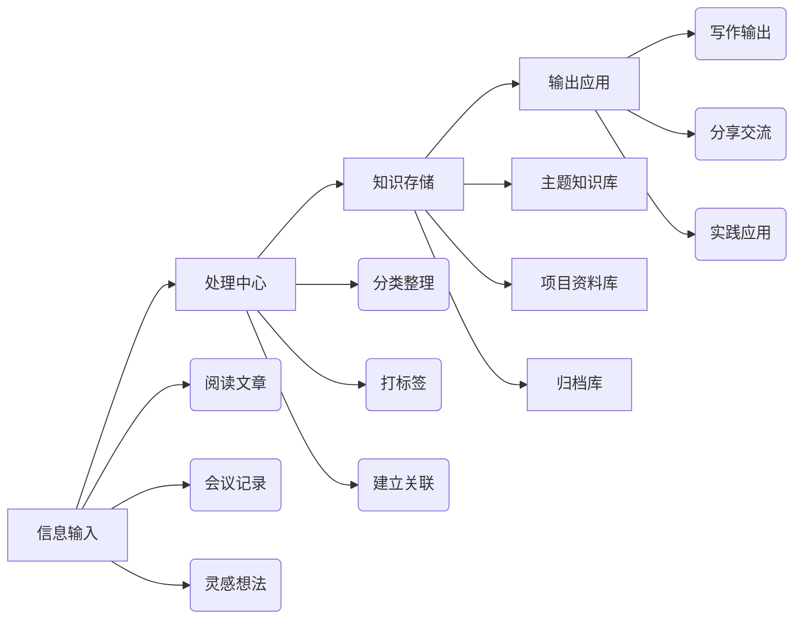

# 为什么需要知识管理系统

<callout emoji="💡" background-color="light-blue">
**核心理念**：知识管理的目标不是收集信息，而是让信息在需要时能够被找到和应用。
</callout>

在信息爆炸的时代，我们每天接触大量信息。建立一个高效的知识管理系统，可以帮助你：

- 📚 **沉淀知识**：将碎片化信息转化为系统化的知识
- 🔍 **快速检索**：在需要时迅速找到相关信息
- 💡 **激发灵感**：通过知识连接产生新的想法
- 📈 **持续成长**：追踪学习轨迹，发现知识盲区

---

## 一、系统设计原则

### 1.1 CORE 原则

<grid cols="2">
<column>

**Capture（收集）**
- 降低收集门槛
- 统一收集入口
- 定期清理筛选

</column>
<column>

**Organize（组织）**
- 分类不宜过细
- 标签辅助检索
- 保持结构灵活

</column>
</grid>

<grid cols="2">
<column>

**Retrieve（检索）**
- 支持多关键词
- 建立知识关联
- 定期回顾复习

</column>
<column>

**Express（表达）**
- 输出倒逼输入
- 知识产品化
- 分享促进理解

</column>
</grid>

### 1.2 常见误区

| ❌ 错误做法 | ✅ 正确做法 |
|------------|------------|
| 追求完美分类 | 先收集后整理 |
| 囤积不消化 | 定期回顾输出 |
| 工具至上主义 | 内容为王 |
| 过度标签化 | 适度标签 + 全文搜索 |

---

## 二、技术架构



---

## 三、实施步骤

### 3.1 第一阶段：搭建框架（第 1-2 周）

<callout emoji="📋" background-color="light-green">
**本周目标**：建立基础知识结构，养成收集习惯
</callout>

1. **选择工具**
   - 飞书云文档（本文档所在平台）
   - 或其他笔记工具

2. **创建核心文件夹**
   - 📁 01-Inbox（收件箱）
   - 📁 02-Areas（领域知识）
   - 📁 03-Projects（项目资料）
   - 📁 04-Archive（归档）

### 3.2 第二阶段：填充内容（第 3-4 周）

**每日习惯**：
- [ ] 收集 3 条有价值的信息
- [ ] 整理当天笔记
- [ ] 标记重要内容

**每周回顾**：
- [ ] 清理 Inbox
- [ ] 更新知识图谱
- [ ] 输出一篇总结

### 3.3 第三阶段：优化迭代（持续进行）

<callout emoji="⚠️" background-color="light-yellow">
**注意**：系统需要持续优化，但不要陷入"工具折腾"的陷阱。每 3 个月回顾一次，问自己：
- 这个系统帮我提高了效率吗？
- 有哪些地方可以简化？
- 最近一次使用是什么时候？
</callout>

---

## 四、实用模板

### 4.1 读书笔记模板

```
# 《书名》- 作者

## 📖 基本信息
- 阅读时间：YYYY-MM-DD
- 推荐指数：⭐⭐⭐⭐⭐

## 💡 核心观点
1. 观点一
2. 观点二

## 📝 精彩摘录
> 引用内容

## 🤔 我的思考
- 如何应用到工作/生活中？
- 与已有知识的关联？

## 🎯 行动清单
- [ ] 行动项 1
- [ ] 行动项 2
```

### 4.2 会议纪要模板

```
# 会议主题

## 📅 会议信息
- 时间：YYYY-MM-DD HH:MM
- 参会人：@相关人员

## 🎯 会议目标


## 📝 讨论要点


## ✅ 决策事项


## 📋 待办任务
- [ ] 任务描述 @负责人 截止日期
```

---

## 五、进阶技巧

### 5.1 知识关联

<lark-table header-row="true">
<lark-tr>
<lark-td>

**关联类型**

</lark-td>
<lark-td>

**说明**

</lark-td>
<lark-td>

**示例**

</lark-td>
</lark-tr>
<lark-tr>
<lark-td>

同主题关联

</lark-td>
<lark-td>

相同主题的文档互相关联

</lark-td>
<lark-td>

多篇 AI 学习笔记

</lark-td>
</lark-tr>
<lark-tr>
<lark-td>

跨领域关联

</lark-td>
<lark-td>

不同领域间的知识连接

</lark-td>
<lark-td>

心理学 × 产品设计

</lark-td>
</lark-tr>
<lark-tr>
<lark-td>

时间线关联

</lark-td>
<lark-td>

按时间顺序追踪演进

</lark-td>
<lark-td>

技术发展历程

</lark-td>
</lark-tr>
</lark-table>

### 5.2 标签体系建议

**按领域**：`#技术` `#产品` `#管理` `#生活`
**按类型**：`#笔记` `#模板` `#清单` `#案例`
**按状态**：`#进行中` `#待处理` `#已完成` `#归档`

<callout emoji="🏷️" background-color="light-purple">
**标签使用建议**：每个文档不超过 5 个标签，过多会降低检索效率。优先使用全文搜索，标签作为辅助。
</callout>

---

## 六、开始行动

<callout emoji="🚀" background-color="light-green" border-color="green">
**现在就开始！**

1. 复制本文档到你的个人空间
2. 根据你的需求调整结构
3. 从今天开始收集第一条笔记
4. 每周回顾，持续优化

**记住**：最好的知识管理系统，是你持续使用的那个系统。
</callout>

---

*最后更新：2026-03-29*
*如有问题或建议，欢迎交流讨论 🙌*
